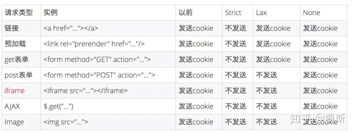

- # RFC
- [Cookies: HTTP State Management Mechanism/draft-ietf-httpbis-rfc6265bis-03](https://datatracker.ietf.org/doc/html/draft-ietf-httpbis-rfc6265bis-03#section-4.1)
- # The Set-Cookie Header
- ## SameSite
- ### 可选值
	- 1. **Strict** 完全禁止[第三方 Cookie]([[第一方 Cookie 第三方 Cookie]])，仅允许[同站]([[站的定义 Site]])请求携带 Cookie。
	  2. **Lax** 允许部分第三方请求携带 Cookie。
	  {:height 240, :width 626} 
	  3. **None** 无论是否跨站都会发送 Cookie。SameSite=none 只支持HTTPS接口。如果要设置该值，需要在对应的 Cookie 上同时设置 Secure 属性。
- ### 浏览器支持状况
	- https://caniuse.com/?search=SameSite
	- Chrome 91版本之前：
		- 2016年开始，Chrome从51版本之后添加了Cookie SameSite 属性，但可以直接通过浏览器可视化配置解除限制。
	- Chrome 91~93版本：
		- 2021年5月，官方出于安全考虑，从91版本开始取消了可视化关闭的方式，但是还可以通过[命令行](https://www.zhihu.com/search?q=%E5%91%BD%E4%BB%A4%E8%A1%8C&search_source=Entity&hybrid_search_source=Entity&hybrid_search_extra=%7B%22sourceType%22%3A%22article%22%2C%22sourceId%22%3A%22478942215%22%7D)启动的方式进行关闭。
	- Chrome 94版本及以上：
		- 2021年9月，已经彻底移除可视化禁用和命令行禁用的方式，详见[官方的SameSite Updates](https://link.zhihu.com/?target=https%3A//www.chromium.org/updates/same-site/)。
		- 但是Chrome浏览器插件不受跨站跨域的限制，所以对于本地调试的场景，可以通过安装相关cookie透传的插件来解决。
	- 可以见得，浏览器对用户隐私的管理政策愈发收紧，各大厂商完全禁用第三方 Cookie 是大势所趋。