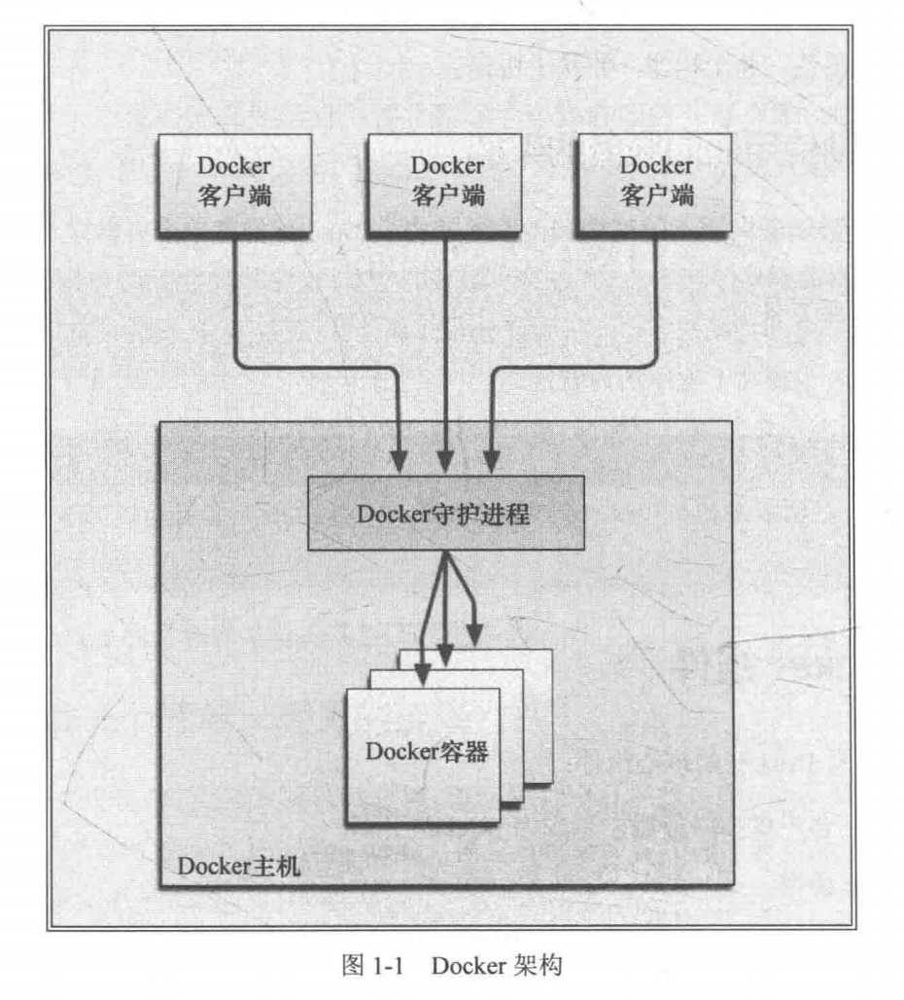
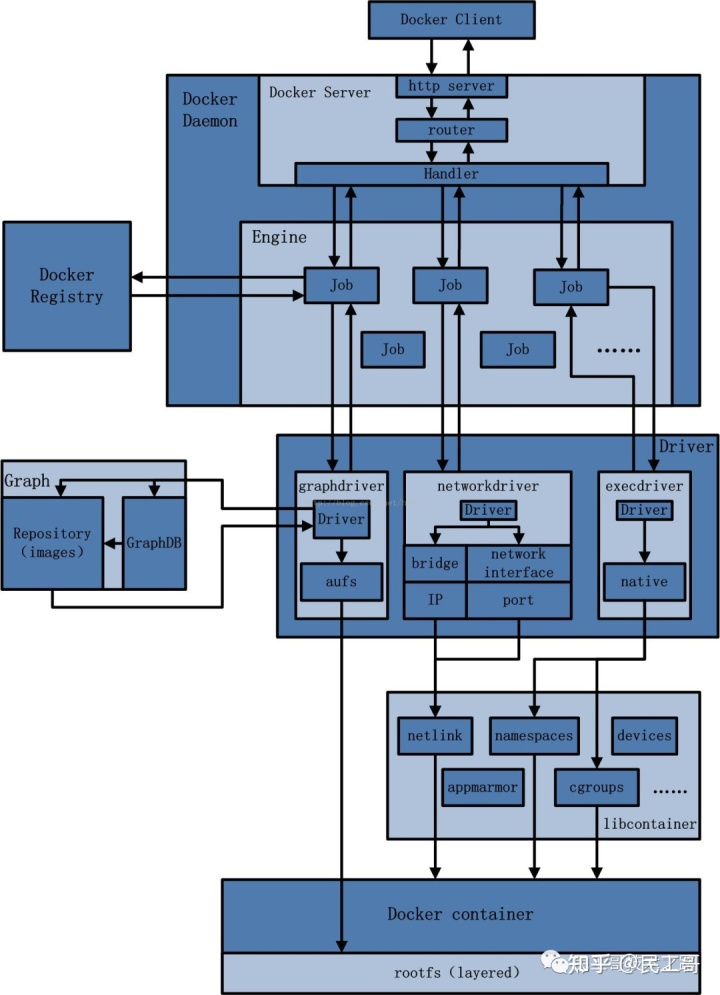
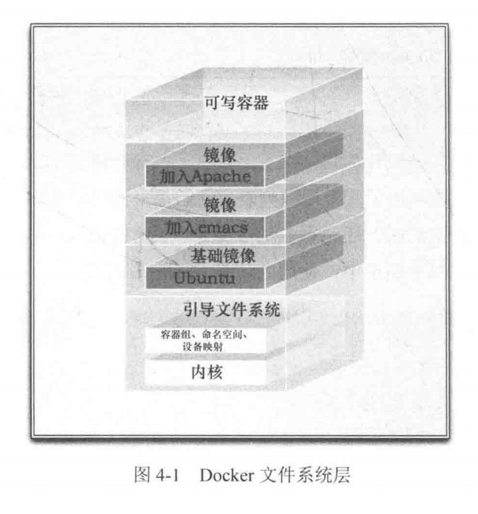

- 构建一次，到处运行 Build onece，run anywhere
- 容器与虚拟化(hypervisor virtualization，HV)的区别 #card
  card-last-interval:: -1
  card-repeats:: 1
  card-ease-factor:: 2.5
  card-next-schedule:: 2022-11-01T16:00:00.000Z
  card-last-reviewed:: 2022-11-01T02:13:10.325Z
  card-last-score:: 1
	-
-
- 权限隔离监牢 chroot jail #card
-
- 传统容器的问题 比较复杂，不易安装，管理和自动化很困难
- 1.1 Docker 简介
- Docker 特殊之处 在虚拟化的容器环境中增加了一个应用程序部署引擎
- 1.1.1 提供一个简单、轻量的建模方式
- Docker 依赖于“写时复制”(copy-on-write)模型，使修改应用程序也非常迅速
- 充分利用系统资源
- 1.1.2 职责的逻辑分离
- 开发人员只需关心容器中运行的应用程序，运维人员只需关心如何管理容器。设计目的就是要加强开发环境和生产环境的一致性。
- 1.1.3 快速、高效的开发生命周期
- 目标之一缩短代码从开发、测试到部署、上线运行的周期，让程序具备可移植性，易于构建，易于协作。
- 1.1.4 鼓励使用面向服务的架构
- 推荐单个容器只运行一个应用程序或进程，形成分布式的应用程序模型。分布式部署、扩展、调试变得简单，提高程序内省性。
-
- 1.2 Docker 组件
- Docker 组件 #card
	- Docker 客户端和服务器，也成为 Docker 引擎
	- Docker 镜像
	- Registry
	- Docker 容器
- 1.2.1 Docker 客户端和服务器
- Docker 是 C/S 架构程序，提供命令行工具 docker 以及一套 RESTful API 来与守护进程交互，可本地可远程。
- {:height 365, :width 323}
- 1.2.2 镜像
- 镜像是 Docker 生命周期中的“构建”部分。由一系列指令一步步构建出来。例如：
- 添加一个文件；-> 执行一个命令； -> 打开一个端口；
- 可以把镜像当做容器的“源代码”。镜像体积很小，易于分享、存储和更新。
- 1.2.3 Registry
- 保存镜像 公有私有
- 1.2.4 容器
- 容器基于镜像启动，镜像是 Docker 生命周期中的构建或打包阶段，而容器则是启动或执行阶段。
- 总结起来，Docker 容器就是：
- 1. 一个镜像格式
  2. 一系列标准的操作
  3. 一个执行环境
- 集装箱概念
- 每个容器包含一个软件镜像，容器对镜像可以进行一些操作。例如，创建、启动、关闭、重启、销毁。
-
- 1.3 能用 Docker 做什么
- 隔离性 创建沙盒环境
- Docker 如何保证环境的一致性？
- Docker PaaS SaaS？
-
- 1.4 Docker 与配置管理
- 传统 “黄金镜像”模型 golden image？底层镜像缺乏适当的灵活性
- Docker 镜像是分层的，可以对其进行迅速迭代
- 幂等性 自省性
- Docker 对不同的宿主机、应用程序和服务，可能会表现出不同的特性与架构？
-
- 1.5 Docker 的技术组件
- {:height 441, :width 313}
- 1. 一个原生的 Linux 容器格式，Docker 中称为 libcontainer
  2. Linux 内核的命名空间(namespace)，用于隔离文件系统、进程和网络
  3. 文件系统隔离：每个容器都有自己的 root 文件系统
  4. 进程隔离：每个容器都运行在自己的进程环境中
  5. 网络隔离：容器间的虚拟网络接口和 IP 地址都是分开的
  6. 资源隔离和分组：使用 cgroups(即 control group，Linux 的内核特性之一)将 CPU 和内存之类的资源独立分配给每个 Docker 容器
  7. 写时复制：文件系统都是通过写时复制创建的，这就意味着文件系统是分层的、快速的，而且占用的磁盘空间更小
  8. 日志：容器产生的 STDOUT、STDERR 和 STDIN 这些 IO 流都会被收集并记入日志，用来进行日志分析和故障排错
  9. 交互式 shell：用户可以创建一个伪 tty 终端，将其连接到 STDIN，为容器提供一个交互式的 shell
-
-
-
- 第三章
- ```shell
  # 创建容器
  $ docker create
  
  # 创建并运行命名容器
  # --name 自命名
  # -i STDIN
  # -t tty
  # -d 守护式容器
  # -p 控制 Docker 在运行时公开哪些网络端口给外部宿主机
  #    1. 默认：Docker 可以在宿主机上随机选择一个位于32768~61000的一个比较大的端口号来映射到容器中的开放端口上。
  #    2. 指定：可以在 Docker 宿主机中指定一个具体的端口号来映射到容器的开放端口上(宿主机:容器)。
  #    使用 /udp 后缀来指定 UDP 端口
  # -P 对外公开在 Dockerfile 中通过 EXPOSE 指令公开的所有端口，绑定随机宿主机端口
  $ docker run --name iiyumewo_ubuntu -it ubuntu
  $ docker run --name daemon_dave -d ubuntu /bin/sh -c "while true; do echo hello world; sleep 1; done"
  $ docker run -d -p 8080:80 --name static_web jamtur01/static_web \
    nginx -g "daemon off;"
  $ docker run -d -p 127.0.0.1:80:80 --name static_web jamtur01/static_web \
    nginx -g "daemon off;"
  $ docker run -d -p 127.0.0.1::80 --name static_web jamtur01/static_web \
    nginx -g "daemon off;"
  $ docker run -d -P --name static_web jamtur01/static_web nginx -g "daemon off;"
  
  # 启动容器
  $ docker start iiyumewo_ubuntu
  
  # 重启容器
  $ docker restart iiyumewo_ubuntu
  
  # 查询所有容器
  # -a 包括未运行的容器
  # -q 只输出容器 ID
  $ docker ps -a
  
  # 附着到容器
  $ docker attach iiyumewo_ubuntu
  
  # 日志
  # -f 持续输出
  # --tail 输出尾部条数
  # -t 加上时间戳
  $ docker logs --tail 20 -t -f daemon_dave
  
  # 查看容器进程
  $ docker top iiyumewo
  
  # 查看容器统计信息
  $ docker stats iiyumewo1 iiyumewo2 iiyumewo3
  
  # 在容器内运行进程
  $ docker exec -d iiyumewo touch /etc/new_config_file
  $ docker exec -it iiyumewo /bin/bash
  
  # 停止守护容器
  # stop SIGTERM 信号
  # kill SIGKILL 信号
  $ docker stop iiyumewo
  $ docker kill iiyumewo
  
  # 自动重启容器 --restart
  # always 无论退出代码是什么都会重启
  # on-failure 退出代码非0时重启
  # on-failure:5 可选参数，指定重启次数
  $ docker run --restart=always --name iiyumewo -d ubuntu /bin/bash
  
  # 查看容器详细(批量信息与容器)
  # -f/--format 查看特定参数，支持完整 Golang 模板
  $ docker inspect --format='{{ .State.Running }} {{ .NetworkSettings.IPAddress }}' iiyumewo1 iiyumewo2
  
  # 删除容器
  # -f 强制删除运行中的容器
  $ docker rm iiyumewo
  $ docker rm `docker ps -a -q`
  
  # 列出镜像
  $ docker images
  $ docker images ubuntu
  
  # 拉取镜像
  $ docker pull ubuntu:12.04
  
  # 在 Docker Hub 查找镜像
  $ docker search puppet
  
  # 登录登出 Registry
  $ docker login
  $ docker logout
  
  # 从容器创建镜像 commit
  # -m 提交信息；-a 作者
  $ docker commit 674437fbf36c iiyumewo/custom_ubuntu
  $ docker commit -m"A new custom image" -a"James Turnbull" \
    674437fbf36c iiyumewo/custom_ubuntu:webserver
    
  # 通过本地或远端 Dockerfile 构建镜像
  # -t 定义仓库、名称、标签（默认 latest）
  # --no-cache 构建忽略缓存
  $ docker build -t="jamtur01/static_web:v1" .
  $ docker build --no-cache -t="jamtur01/static_web:v1" \
    git@github.com:jamtur01/docker-static_web
    
  # 查看镜像构建历史
  $ docker history 22d47c8cb6e5
  
  # 查看容器的端口的映射情况
  $ docker ps
  $ docker port static_web 80
  
  # 推送镜像到 Registry
  $ docker push youruser/yourimage
  
  # 删除镜像
  $ docker rmi youruser/yourimage1 youruser/yourimage2
  # 删除所有镜像
  $ docker rmi `docker images -a -q`
  
  # 镜像打标签
  $ docker tag iiyumewo/static_web docker.example.com:5000/iiyumewo/static_web
  
  # 容器文件拷贝
  $ docker cp mycontainer:/opt/testnew/file.txt /opt/test/
  $ docker cp /opt/test/file.txt mycontainer:/opt/testnew/
  ```
-
- 更多日志相关参考 [[Docker Logging]]
-
- 第四章
- 4.1 什么是 Docker 镜像
- Docker 容器分层 #card
	- 引导文件系统 **bootfs**。当容器启动后，它会被移动到内存中，引导文件系统则会被卸载。(unmount)
	- root 文件系统 **rootfs**。位于引导文件系统之上，rootfs 可以是一种或多种操作系统。
	- Docker 中，rootfs 永远只读，利用联合加载(union mount)叠加多个文件系统。
	- Docker 将这样的文件系统称为镜像。位于下面的镜像为父镜像(parent image)，最底部的镜像称为基础镜像(base image)。
	- 当从一个镜像启动容器时，Docker 会在该镜像最顶层加载一个读写文件系统。Docker 在这个读写层中运行用户的程序。
	- {:height 358, :width 328}
- 写时复制(copy on write) #card
	- 当 Docker 第一次启动一个容器时，初始的读写层是空的。当文件系统发生变化时，这些变化都会应用到这一层上。比如如果想修改一个文件，这个文件首先会从该读写层下面的只读层复制到该读写层。该文件的只读版本依然存在，但是已经被读写层中的该文件副本所隐藏。
	- 每个只读镜像层都是只读的，并且以后永远不会变化。当创建一个新容器时，Docker 会构建出一个镜像栈，并在栈顶添加一个读写层。这个读写层再加上其下面的镜像层以及一些配置数据，就构成了一个容器。镜像分层框架(image-layering framework)使我们可以快速构建镜像。
-
- Docker Hub 分为：用户仓库(user repository)和顶层仓库(top-level repository)。
- 用户仓库命名规则为用户名/仓库名，如 jamtur01/puppet。
- 顶层仓库代表了各厂商和 Docker 公司的一种承诺，即顶层仓库中的镜像是架构良好、安全且最新的。
- 镜像签名？？
-
- 4.5.3 用 Dockerfile 构建镜像
- [[Dockerfile]]
-
- Docker Hub 提供自动构建功能
- 搭建私有 Docker Registry
- ```shell
  $ docker run -p 5000:5000 registry:latest
  $ docker tag iiyumewo/static_web docker.example.com:5000/iiyumewo/static_web
  $ docker push docker.example.com:5000/iiyumewo/static_web
  ```
-
-
-
-
-
-
-
-
-
-
-
-
-
-
-
-
-
-
-