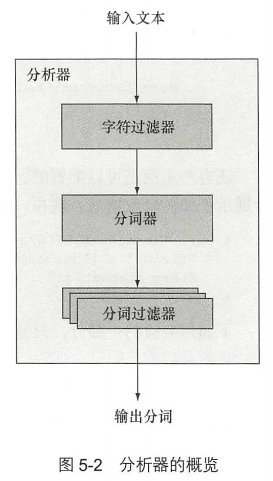
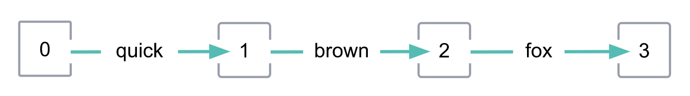
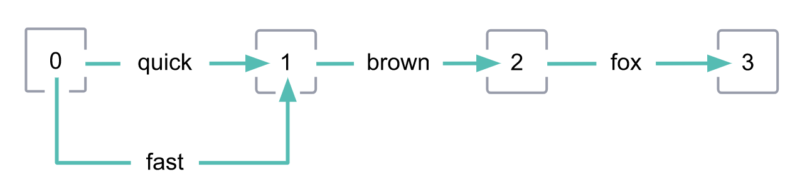
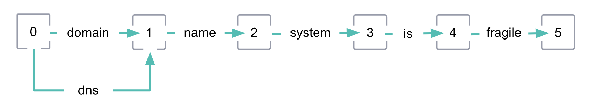

- # 概述
- 文本分析的过程
- ## 符号化 Tokenization
- 将完整的文本打碎成更小的单位，称为 token。在英文分词中，通常是单个单词。
- ## 标准化 Normalization
- Tokenization 后的单词仍然只能在字面上进行匹配 `Quick != quick` `fox != foxes` `jumps != leaps`
- 而 Normalization 处理后的 token 则更加具有一般性，上述失败的匹配都可以被查询得到。
-
- # 概念
- ## 分析器(Analyzer)的构成
- 内置分析器或自定义分析器都由三个部分组成——字符过滤器(character filters)，分词器(tokenizers)， 分词过滤器(token filters)。
- {:height 359, :width 216}
- ### 字符过滤器 Character filters
- 对输入文本做**添加**、**删除**或**修改**。٠‎١٢٣٤٥٦٧٨‎٩‎ -> 0123456789 或删除 HTML 标签等。
- 分析器可能**有零个或多个**字符过滤器。
- ### 分词器 Tokenizer
- 将文本分解为更小的单位(通常是单词)。
- ？？？ 分词器还负责记录每个单词的顺序或位置，以及该单词相对原始单词的字符偏移量(character offsets)。
- 分析器**有且仅有一个**分词器
- ### 分词过滤器 Token filters
- ？？？ *令牌过滤器*接收令牌流并可以添加、删除或更改令牌。例如，`lowercase` 记号过滤器将所有记号转换为小写， 记号过滤器从记号流 `stop` 中删除常用词（*停用词*） ，记号过滤器将同义词引入记号流。 `the` `synonym` 令牌过滤器不允许更改每个令牌的位置或字符偏移量。
- 分析器可能**有零个或多个**令牌过滤器
- ## 索引分析与搜索分析
- 两个场景会进行文本分析：
- 索引时：当一个文档被索引时，任何 `text` 字段值都会被分析。
- 搜索/查询时：在 `text` 类型字段上执行全文搜索(full-text search)时，会进行文本分析。
- ### 索引分析和搜索分析如何协同工作
- 大多数情况下，搜索分析器和索引分析器会配置为同一个，保证 token 的处理过程是一致的，搜索结果可以预期。
- ### 何时使用不同的搜索分析器
-
- ## 词干化 Stemming
- walking -> walk
- jumping, jumpiness -> jumpi
-
- ### 词干分词过滤器 Stemmer Token filters
- 词干过滤器就是一种特殊的分词过滤器，这类分词过滤器根据他们的词干化方式分为两类：
	- 算法词干化，根据一组算法规则词干化
	- 字典词干化，通过在字典中查词来词干化
- 由于词干化会改变 token，因此我们建议在索引和搜索期间使用相同的词干分词过滤器。
-
- ### 算法词干化 Algorithmic stemmers
- 优点：
	- 开箱即用
	- 不占内存
	- 比字典词干化快
- 但是大多数算法词干分析器只会更改单词的现有文本。这意味着它们可能无法很好地处理不包含其词根形式的不规则单词，例如：
	- `be` ,  `are` , 和 `am`
	- `mouse` 和 `mice`
	- `foot` 和 `feet`
- 以下分词过滤器使用算法词干化：
	- [`stemmer`](https://www.elastic.co/guide/en/elasticsearch/reference/8.4/analysis-stemmer-tokenfilter.html)，它为多种语言提供算法词干提取，其中一些具有额外的变体。
	- [`kstem`](https://www.elastic.co/guide/en/elasticsearch/reference/8.4/analysis-kstem-tokenfilter.html)，一个结合了算法词干和内置词典的英语词干分析器。
	- [`porter_stem`](https://www.elastic.co/guide/en/elasticsearch/reference/8.4/analysis-porterstem-tokenfilter.html)，我们推荐的英语算法词干分析器。
	- [`snowball`](https://www.elastic.co/guide/en/elasticsearch/reference/8.4/analysis-snowball-tokenfilter.html)，它对 多种语言使用基于 [Snowball的词干提取规则。](https://snowballstem.org/)
-
- ### 字典词干化 Dictionary stemmers
- 适用于：
	- 词干不规则词
	- 区分拼写相似但概念上不相关的单词，例如：`organ` 和 `organization`、`broker` 和 `broken`
- 缺点：
	- **字典质量**
	- 字典词干分析器的好坏取决于它的字典。为了正常工作，这些词典必须包含大量单词，定期更新，并随着语言趋势而变化。通常，当字典可用时，它是不完整的，并且其中的一些条目已经过时了。
	- **大小和性能**
	- 词典词干分析器必须将其词典中的所有单词、前缀和后缀加载到内存中。这可能会使用大量 RAM。低质量的字典在去除前缀和后缀时可能效率较低，这会显着减慢词干提取过程。
- 可以使用 [`hunspell`](https://www.elastic.co/guide/en/elasticsearch/reference/8.4/analysis-hunspell-tokenfilter.html) 令牌过滤器来执行字典词干提取。
- ？？？ 建议在使用 `hunspell` 之前，先用对 token 流执行算法词干化。
-
- ### 控制词干化
- 有时，词干化会产生拼写相似但概念上不相关的共享词根。例如，词干化会将 `skies` 和 `skiing` 转化为同一个词根： `ski` 。
- 为了防止这种情况并更好地控制词干化，您可以使用以下标记过滤器：
	- [`stemmer_override`](https://www.elastic.co/guide/en/elasticsearch/reference/8.4/analysis-stemmer-override-tokenfilter.html)，它允许您定义用于词干特定标记的规则。
	- [`keyword_marker`](https://www.elastic.co/guide/en/elasticsearch/reference/8.4/analysis-keyword-marker-tokenfilter.html)，它将指定的标记标记为关键字。关键字标记不会被后续的词干分析器标记过滤器提取。
	- [`conditional`](https://www.elastic.co/guide/en/elasticsearch/reference/8.4/analysis-condition-tokenfilter.html)，可用于将标记标记为关键字，类似于 `keyword_marker` 过滤器。
- 对于内置[分析器](https://www.elastic.co/guide/en/elasticsearch/reference/8.4/analysis-lang-analyzer.html)，您还可以使用该 [`stem_exclusion`](https://www.elastic.co/guide/en/elasticsearch/reference/8.4/analysis-lang-analyzer.html#_excluding_words_from_stemming)参数来指定不会被词干的单词列表。
-
- ## 分词图 Token graphs
- 分词器会绘制分词图(有向无环图)，记录：
	- `position` token 在流中的位置
	- `positionLength` token 在流中跨越的位置
- 
-
- ### 同义词 Synonyms
- 一些分词过滤器会将同义词添加入 token 流，在分词图上会留下这样的标记(通常同义词和原词跨度相同)：
- 
-
- ### 可变长度的分词 Multi-position tokens
- atm -> automatic teller machine(图类分词过滤器 graph token filter)：
	- [ `synonym_graph` ](https://www.elastic.co/guide/en/elasticsearch/reference/8.4/analysis-synonym-graph-tokenfilter.html)
	- [ `word_delimiter_graph` ](https://www.elastic.co/guide/en/elasticsearch/reference/8.4/analysis-word-delimiter-graph-tokenfilter.html)
- domain name system -> dns
	- [ `nori_tokenizer` ](https://www.elastic.co/guide/en/elasticsearch/plugins/8.4/analysis-nori-tokenizer.html)
-
- ### 利用分词图进行搜索
- 索引会忽略 `positionLength`，且不支持分词图包含跨 `position` 的 token。
- 但是诸如 `match`、`match_phrase` 查询，可以通过分词图生成多个派生词的子查询。
- 其实只要搜索和索引有一边支持就行了，从节省存储的角度来说肯定会放在搜索这边。
-
- ### 无效分词图
- 如下分词过滤器不管派生词长度多少都只会记录为1：
	- [ `synonym` ](https://www.elastic.co/guide/en/elasticsearch/reference/8.4/analysis-synonym-tokenfilter.html)
	- [ `word_delimiter` ](https://www.elastic.co/guide/en/elasticsearch/reference/8.4/analysis-word-delimiter-tokenfilter.html)
- 
- 避免使用错误的分词图进行搜索，很可能会导致意想不到的结果。
-
- # 配置文本分析 Configure text analysis
-
-
-
-