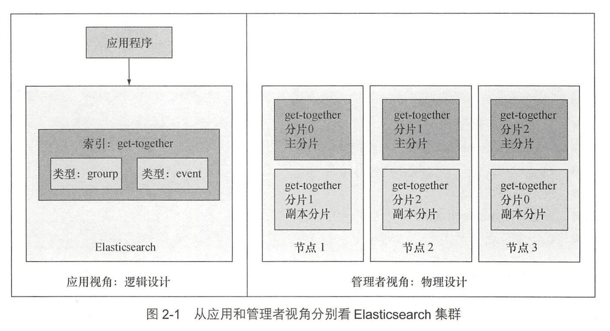
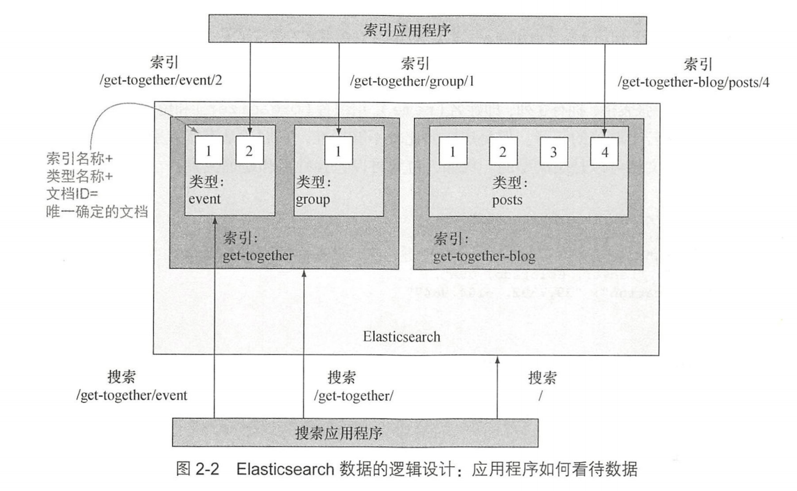
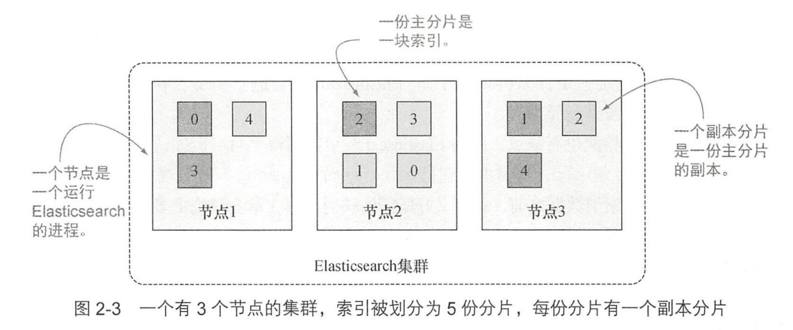
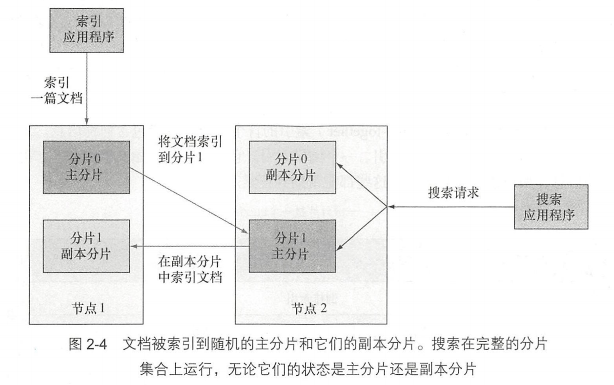
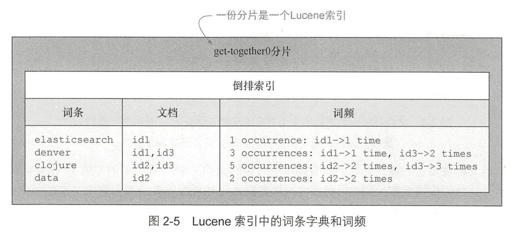
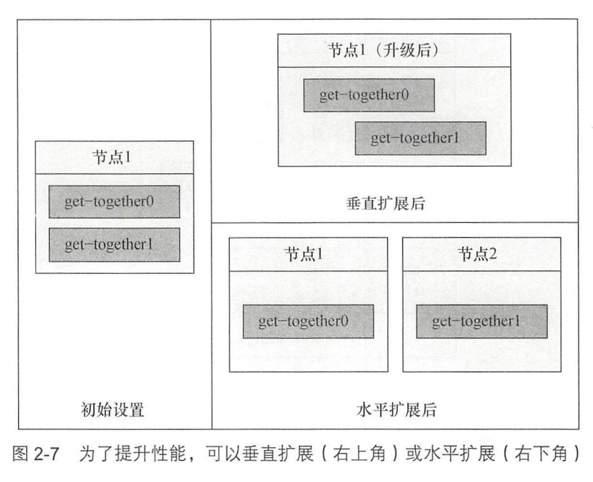
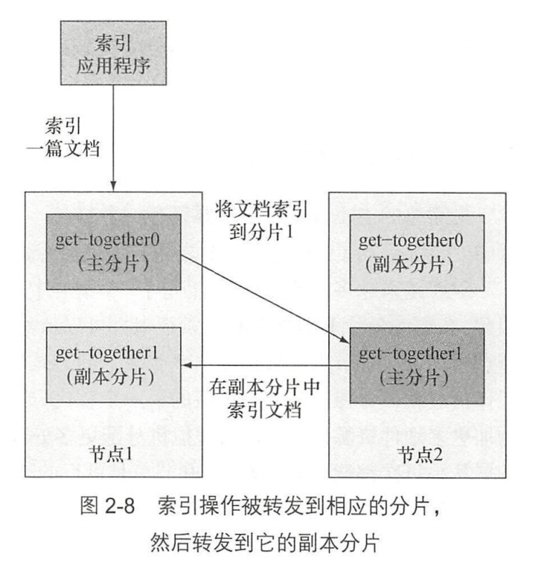
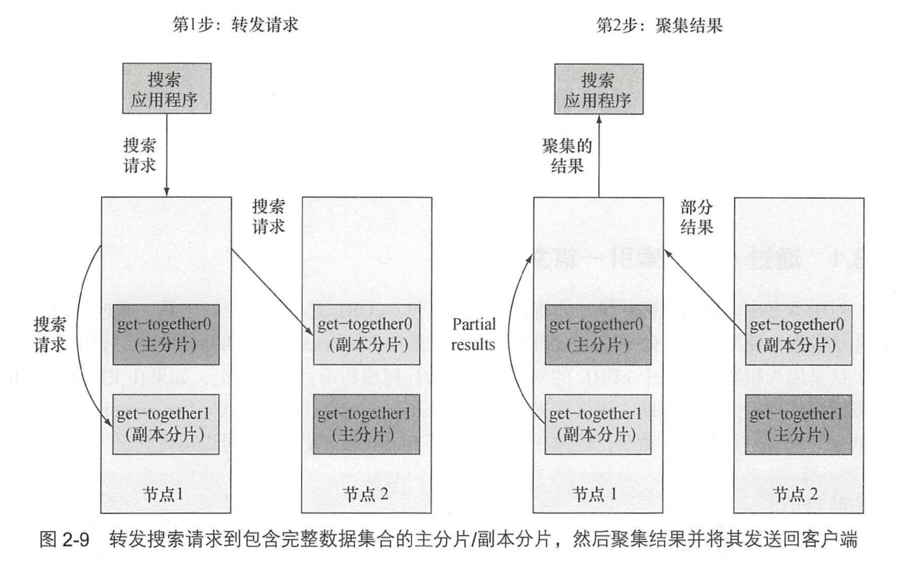

- 水平扩容 丰富的分析功能
- 与 Lucene 的关系？
- Elasticsearch 目前对事务的支持？
-
-
-
-
-
-
-
-
-
- 2
- 逻辑设计(应用视角)与物理设计(管理者视角)
- {:height 336, :width 539}
- 2.1
- 索引-> 类型 -> 标签(ID)
- {:height 415, :width 661}
- 2.1.1 文档
- 面向文档
- 文档重要属性：
- 1. 它是自我包含的
  2. 它可以是层次型的
  3. 它拥有灵活的结构
- JSON
- 2.1.2 类型
- 类型 = 映射类型
- 无模式 可以缺可以多
- 自动类型推断可能出错 安全的做法是在索引数据之前定义好类型映射
- 2.1.3 索引
- refresh_interval 刷新索引非常消耗性能 默认是1s更新一次 -> 准实时
- 跨索引搜索
- 2.2 理解物理设计：节点和分片
- 默认1个索引5个分片
- {:height 256, :width 598}
- 2.2.1 创建拥有一个或多个节点的集群
- 一个 Elasticsearch 实例是一个节点，同一台服务器可以有多个 ES 进程，单机多节点
- 集群缺点：必须确定节点之间能够足够快速地通信，并且不会产生大脑分裂(集群的2个部分不能彼此交流，都认为对方宕机了)
- 散列值选择主分片索引 -> 所有副本分片索引 -> 数据同步
- {:height 402, :width 630}
- 搜索索引在主副分片间负载均衡
- 2.2.2 理解主分片和副本分片
- 一份分片 = Lucene 索引，包含倒排索引的文件目录
- Elastic 索引指的是多个 Lucene 索引(分片)组成的完整索引
- 词条字典 词频 相关性得分
- {:height 296, :width 629}
- {:height 377, :width 383}
- 副本分片可以在运行时添加或移除，主分片不可以
- 主分片数量必须在创建索引前决定
- 主分片少限制扩展性 主分片多影响性能
- 2.2.3 在集群中分发分片
- {:height 376, :width 463}
- 2.2.4 分布式索引和搜索
- {:height 569, :width 527}
- 查询时使用 round-robin 轮询机制选择可用分片，并将搜索请求转发过去，收集结果聚集到单一恢复，然后返回客户端
- {:height 367, :width 576}
- 2.3 索引新数据
- 2.3.1 通过 cURL 索引一篇文档
- ES 弃用类型
- 2.3.2 创建索引和映射类型
- acknowledged
- 2.3.3 通过代码样例索引文档
- [官方文档](https://www.elastic.co/guide/en/elasticsearch/reference/8.4/index.html)
-
-
-
-
-
-
-
-
-
-
-
-