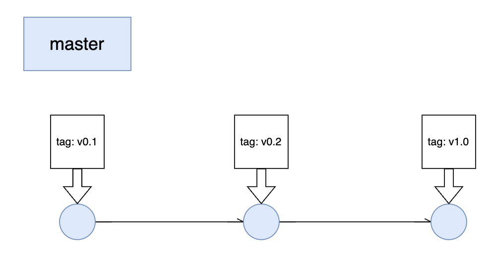
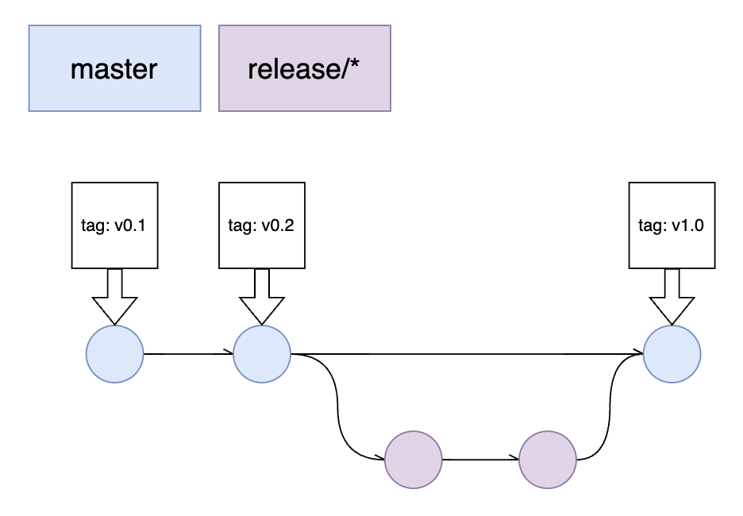
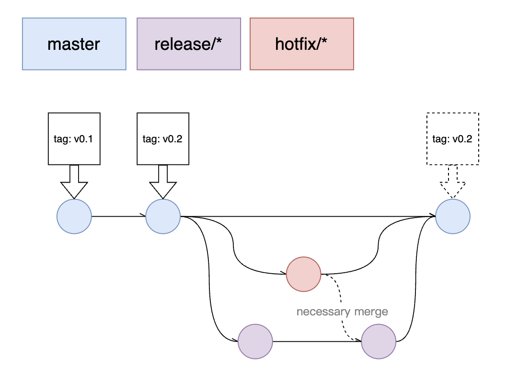
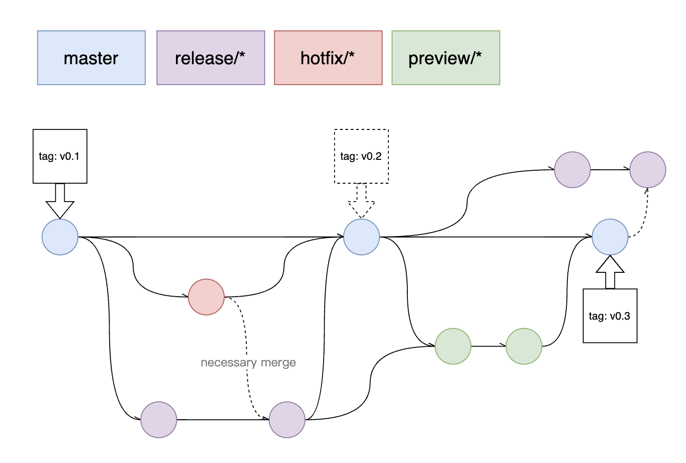
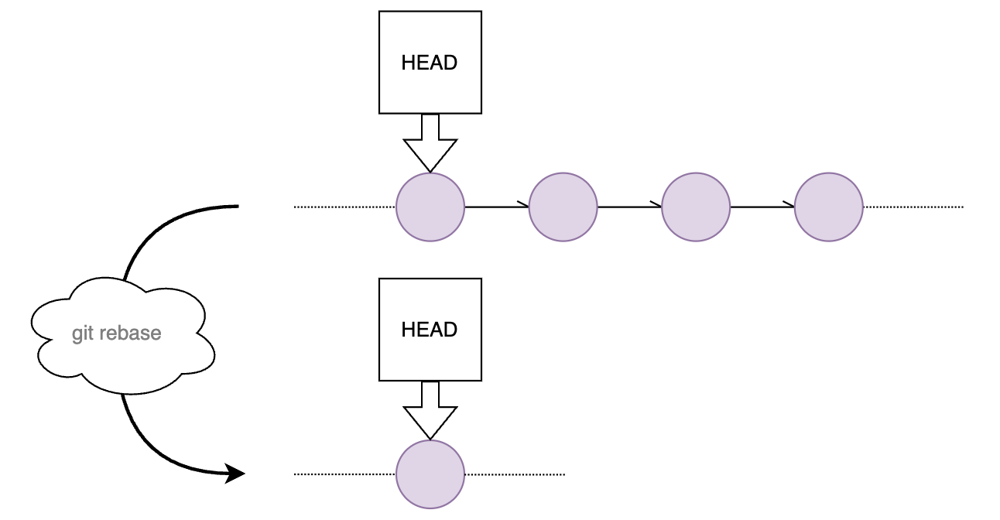
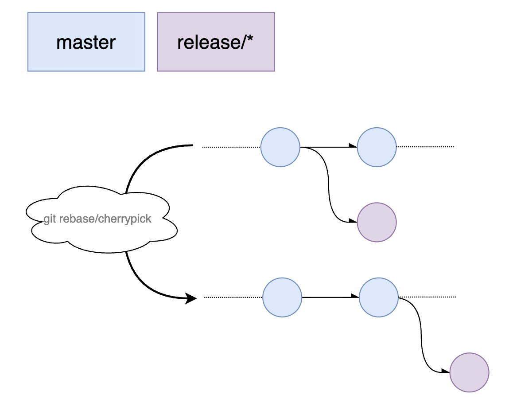

- # 分支管理
- ### master 分支
- 仅用于线上发布，任意一个线上 `commit` 都需要打 `tag`，并在远端同步。标签的主要作用是发布节点的归档与回滚的锚点。
- 即便项目没有版本号，也应使用自定义的开发版本号替代。
- {:height 271, :width 449}
-
- ### 开发分支
- 以 `release/` 为前缀做分支收纳，具体格式为 `release/{ developing version }`，例如 `release/1.1`、`release/1.5.2` 等。在该开发中版本未发布之前的 feature 开发均提交在该分支中。
- {:height 308, :width 444}
-
- ### 针对线上的 bug 修复分支
- 应当以 `hotfix/` 前缀做分支收纳，具体格式为 `hotfix/{ YYYYMMDD }-{ bug component or intro }`，例如 `hotfix/20221012-token`、`hotfix/20221010-watcher-queue` 等。
- 线上修复视规模大小决定是否给与发布节点一个新的 `tag`。
- `hotfix` 分支视 `release` 分支需求与否，适当地将代码合并入其中，这之中分两种情况：
- * 修复内容与开发中内容冲突不多，直接 merge 即可。
  * 修复内容依赖的基础代码已与开发分支差别极大，考虑 git cherry pick 入 `release` 分支。
- {:height 351, :width 468}
-
- ### 扩展分支
- 在此 `Git-Flow` 中，分支的扩展性很好。可以视开发需求，任意拓展自定义分支。例如在某一开发阶段中，增加了预演环境，并且会有多版本交错开发的情况出现。
- 只要明确以下几个原则，分支管理就不会出错：
- 1. `master` 用来发布线上版本。
  2. 哪里需要修复 `hotfix` 就在哪个分支上创建(不可能在 `release` 上)。
  3. 如果在跨版本开发过程中需求其他分支的代码，需要思考两点，一是合并不能影响到master，二是是否会合入超越版本的代码。
- {:height 369, :width 533}
-
- ### 远程分支管理
- 1. `master` 分支设置为 `default branch`，提供两种保护：**不可删除**、**不可被强制推送**。
  2. 统配 `v*` 将所有发布标签设置为 `protected tags`，提供以下保护：**不可删除**、**不可更改**、**避免创建于分支同名的标签**。
-
- ### 分支管理总结
- | 分支名称 | 命名规则 | 功能概述 |
  | :-----| ----: | :----: |
  | master | N/A | 线上发布分支 |
  | release | release/{ developing version } | 版本开发分支 |
  | hotfix | hotfix/{ YYYYMMDD }-{ bug component or intro } | 非开发阶段修复分支 |
-
- ### Git 树的剪枝
- 对 Git 树进行审视，适当利用 `git rebase` 或 `git cherrypick` 修剪 Git 树，使分支保持清爽，利于 `code review` 及历史追溯，不至于淹没在 `git log` 出的垃圾提交海洋之中。**务必确保在本地开发的分支上进行编辑，避免 Git 树型变动导致的本地提交记录丢失**。
- 1. 合并本地连续的杂乱改动 `commit` 再推送远端。
- {:height 278, :width 520}
- 2. 避免不必要的 `merge commit` 提交。
- {:height 405, :width 506}
-
- # 提交规范
- 规避不规范 Git 提交信息诸如：`修复某些 bug`、`编辑部分注释`、`111` 等等。
- 一个好的 `commit message` 应该具备如下特征：
- 1. commit message 可读性
- 2. 信息分类
- 3. 为 git log 提供可查询的关键字
-
- ### 提交组成
- ```sh
  <type>([optional scope]): <description>
  [optional body]
  [optional footer]
  
  # 最简单的提交，只包含必填参数
  optimization: 为 permission.js 重写鉴权逻辑
  
  # 齐全的提交信息
  feature(dashboard): 为面板添加了饼图与折线图的切换 
  #12204
  
  # 跳过 Gitlab CI pipeline (在配置了某环境持续集成的情况下)
  dependency: 更新了 node-sass 的版本
  [ci skip]
  ```
-
- ### 提交类型 types
- ***必填*** 该参数是对本次提交类型的选择
- `feat`  产品新功能的提交
- `fix`  bug 修复的提交
- `optimization`  代码优化、部分重构、命名变更、抽象封装、文档及注释的提交
- `test`  单元测试的修改
- `foundation`  构建脚本、配置文件、CI 脚本、脚手架、三方依赖变更等的提交
- `other`  无法归类的提交，例如代码合并或某些依赖线上环境的临时测试代码
-
- ### 提交模块 scope
- ***选填*** 该参数描述本次修改涉及到的模块名称
-
- ### 提交描述 description
- ***必填*** 提交描述尽量详细，行内书写，小于100字，注意结尾不加标点符号，保持格式的整齐
-
- ### 提交体 body
- ***选填*** `feature` 与 `bugfix` 提交经常会与某个特定的任务挂钩，将任务的编号展示在信息中
-
- ### 提交尾 footer
- ***选填*** 例如在测试环境提供了管道供项目持续集成的话，该选项可以在某些不必要的提交中通过添加 `[skip ci]` 跳过 CI 流程
-
-
- ## 提交检查 Commit Lint
- 我们通过 `commitlint` + `Husky` 配合来确保本地仓库提交信息是符合规范的
- 安装与初始化
- ```shell
  # https://commitlint.js.org/#/guides-local-setup
  # 安装与初始化
  npm install --save-dev @commitlint/{cli,config-conventional}
  npm install husky --save-dev
  npx husky add .husky/commit-msg  "npx --no -- commitlint --edit ${1}"
  ```
- 在项目根目录下创建 `commitlint.config.js`，内容如下：
- ```JavaScript
  const Configuration = {
    /*
     * Resolve and load @commitlint/config-conventional from node_modules.
     * Referenced packages must be installed
     */
    extends: ["@commitlint/config-conventional"],
    /*
     * Resolve and load conventional-changelog-atom from node_modules.
     * Referenced packages must be installed
     */
    // parserPreset: "conventional-changelog-atom",
    /*
     * Resolve and load @commitlint/format from node_modules.
     * Referenced package must be installed
     */
    formatter: "@commitlint/format",
    /*
     * Any rules defined here will override rules from @commitlint/config-conventional
     */
    rules: {
      "type-enum": [
        2,
        "always",
        ["feat", "fix", "optimization", "test", "foundation", "other"],
      ],
    },
    /*
     * Functions that return true if commitlint should ignore the given message.
     */
    ignores: [
      (commit) => {
        return commit === ""
      },
    ],
    /*
     * Whether commitlint uses the default ignore rules.
     */
    defaultIgnores: true,
    /*
     * Custom URL to show upon failure
     */
    helpUrl:
      "https://github.com/conventional-changelog/commitlint/#what-is-commitlint",
    /*
     * Custom prompt configs
     */
    prompt: {
      messages: {},
      questions: {
        type: {
          description: "please input type:",
        },
      },
    },
  }
  
  module.exports = Configuration
  
  ```
-
-
- ## 审视 Git 规范
- 我们通过 Linux 内核开发工作流程中，围绕 Git 展开的七个重要基本原则来审视我们的 Git 规范，有哪些原则是通过 Lint 工具保障的，有哪些原则则是需要我们主动遵守的。Linux 规则只截取部分段落，完整部分可以在[这里](https://cloud.tencent.com/developer/news/681800)查看。
- ### 每次 commit 只能做一件事
- > Linux 的中心原则是，所有更改都必须分解为小步骤进行 —— 您的每个 commit 都只能做一件事。这并不意味着每个 commit 都必须很小，比如对在数千个文件中使用的函数的 API 进行简单更改，可以使更改量很大，但仍然可以接受，因为它是针对某一项单一任务的更改。
- 在每次动手写代码之前，先想一想 commit message 怎么写。如果内容太少写不出，或内容太杂写不下的话，那显然就是违背了这条准则。
- ### commit 不能破坏构建
- > 不仅应该将所有更改分解为尽可能小的变量，而且还不能破坏内核。即每个步骤都必须完全起作用，并且不引起退化。这就是为什么对函数原型的更改还必须更新调用它的每个文件，以防止构建中断的原因。因此，每个步骤都必须作为一个独立的更改来工作。
- 你可以简单地把它类比成事务的原子性，保证提交的原子性，让每个提交所做的事情要么全都成功，要么回滚让所有内容全都失败。不应该存在出于中间状态的提交。
- ### 所有代码都是二等分的
- > 如果在某个时候发现了错误，则需要知道是哪个更改导致了问题。从本质上讲，二等分是一种操作，它使开发者可以找到所有发生错误的确切时间点。为此，请转到最后一个已知的工作 commit 所在的节点，并且已知第一个 commit 已损坏，然后在该点测试代码。如果可行，则前进到下一个节点；如果不是，则返回更上层的节点。这样一来，开发者就可以在十几次编译/测试中，从成千上万的可能 commit 中分离出导致问题出现的 commit 。Git 甚至可以通过 **git bisect **功能帮助自动化该过程。重要的是，这只有在开发者遵守以前的规则的情况下才能很好地起作用：每个 commit 仅做一件事。否则，您将不知道是 commit 的许多更改中的哪一个导致了问题；如果 commit 破坏了构建让整个项目无法正常启动，同时等分线又恰好落在了该 commit 上，则您将不知道接下来是该往上一个节点测试还是往下一个节点测试，因为它们都有问题。这意味着您永远都不应编写依赖于将来 commit 的 commit ，例如：调用尚不存在的函数，或更改全局函数的参数而不更改同一 commit 中的所有调用者。
-
- ### 永远不要 rebase 公共分支
- > rebase 这些公共分支后，已重新基准化的 commit 将不再与基于原存储库中的相同 commit 匹配。在树的层次结构中，不是叶子的公共主干部分不能重新设置基准，否则将会破坏层次结构中的下游分支。
- 这在之前的章节我们已经具体讨论过 rebase 与 cherrypick 对 Git 树的修剪了，这里再重申一下，**务必确保在本地开发的分支上进行编辑，避免 Git 树型变动导致的本地提交记录丢失**。
- ### Git 正确合并
- > 其他的版本管理系统是合并来自不同分支代码的噩梦，它们通常难以弄清代码冲突，并且需要大量的手动工作来解决。而 Git 的结构可以轻松完成这项工作，因此 Linux 项目也从中直接受益。这就是为什么 5.8 版本的大小并不重要的重要原因。在 5.8-RC1 发布周期中，平均每天有 200个 commit ，并从 5.7 版本中继承了 880 个合并。一些维护者注意到了其中增加的工作量，但是对此仍然没有感到什么太大的压力或者导致倦怠。
-
- ### 保留定义明确的 commit 日志
- > 不幸的是，这可能是许多其他项目忽略的最重要的原则之一。每个 commit 都必须是独立的，这也应该包括与该 commit 相应的日志。内核贡献者必须在更改的 commit 日志中做出说明，让所有人了解与正在进行的更改相关的所有内容。Rostedt 提到，他自己的一些最冗长和最具描述性的变更日志，往往是针对一些单行代码提交的，因为这些单行代码更改是非常细微的错误修复，且代码本身包含的信息极少。因此更改的代码越少，日志反而应该说明得更详细。在一个 commit 过了几年之后，几乎没有人会记得当初为什么进行更改。Git 的 blame 功能就可以显示这些代码的修改记录。比如一些 commit 可能非常古老，也许您需要去除一个锁定，或者对某些代码进行更改，而又不确切知道它为什么存在，就可以使用 git blame 来查看。编写良好的代码更改日志可以帮助确定是否可以删除该代码或如何对其进行修改。Rostedt 说：“有好几次我很高兴能在代码上看到详细的变更日志，因为我不得不删除这些代码，而变更日志的描述让我知道我这么做是可以的。”
- ### 持续测试和集成
- > 最后一项基本原则是开发过程中进行持续测试和持续集成。在向上游发送 commit 请求之前，开发者会测试每个 commit 。Linux 社区还有一个名为 Linux-next 的镜像 ，它提取维护人员在其存储库的特定分支上进行的所有更改，并对其进行测试以确保它们能正确集成。Linux-next 非常有效地运行着整个内核的可测试分支，该分支将用于下一个发行版。Linux-next 是一个公共仓库，任何人都可以测试它，这种情况经常发生 —— 人们现在甚至发布有关 Linux-next 中代码的错误报告。事实上，已经进入 Linux-next 几周的代码基本上可以确定会最终进入主线发行版中。
-
## Unlinked References
-
-
-
-
-
-
-
-
-
-
-