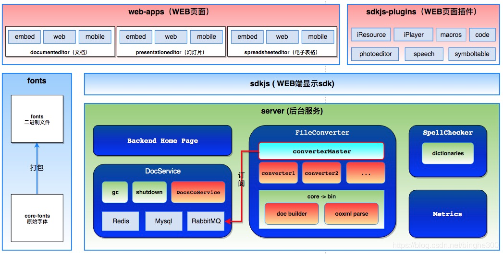
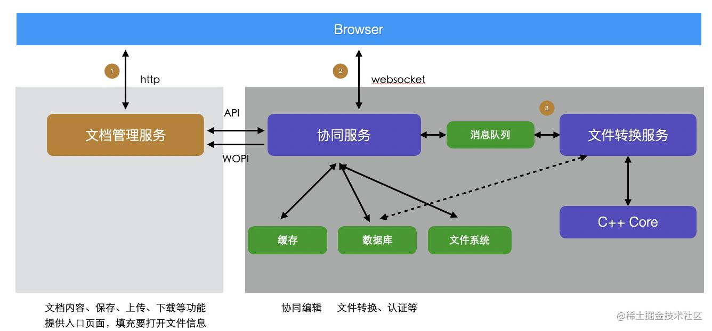

- Docker 部署
- [Installing ONLYOFFICE Docs Community Edition for Docker on a local server](https://helpcenter.onlyoffice.com/installation/docs-community-install-docker.aspx?_ga=2.51711023.782359554.1594636128-1157782750.1587541027)
- ``` shell
  sudo docker run -i -t -d -p 8666:80 -e JWT_ENABLED=false --restart=always onlyoffice/documentserver
  ```
-
-
- https://api.onlyoffice.com/editors/troubleshooting
- [docker 中怎么拷贝东西到镜像，和拷贝出来](https://blog.csdn.net/yechen1/article/details/103830672)
- docker ps
-
- 阿里云 onlyoffice document server 镜像 http://139.196.90.252:8666/welcome/
-
-
-
- 整个ONLYOFFICE都除了文档转码（core）部分为C++开发，其他全部使用node.js开发
- 后台的主要服务（DocService,FileConverter,SpellChecker,Metrics）都是通过pkg打包成可执行文件，摆脱node环境的依赖
- 中文字体的生成的打包会通过 core中编译的工具 allfontsgen 来实现，可以在前端应用的编辑页面中展示中文字体（注意中文字体需要有中文family_name和英文family_name两个字体才可以正常生成中文）
- {:height 397, :width 767}
-
-
- 
-
- 
-
-
- DocumentSearch 搜索引擎实例
- Paragraph 搜索结果数组中存储的类(Elements)
-
-
- SearchEngine.Selection 存储了有搜索结果的 Paragraph
- Paragraph.prototype.Internal_Draw_3 负责绘制高亮
-
-
- CDocument.SetParagraphHighlight
- CDocument.AddToParagraph
- CDocument.controller_AddToParagraph
- CDocument.FinalizeAction();
-
-
-
- 选取并高亮
- para.Selection.Use = true
- para.Selection.Start = false;
- console.log(searchRes.StartPos)
- console.log(searchRes.EndPos)
- para.Set_SelectionContentPos(searchRes.StartPos, searchRes.EndPos)
- para.Document_SetThisElementCurrent(true)
-
- // editor.WordControl.m_oLogicDocument.UpdateSelection()
- const TextPr = new ParaTextPr({HighLight: new CDocumentColor(0, 255, 0)})
- console.log("TextPr", TextPr)
- console.log("para", para)
- editor.WordControl.m_oLogicDocument.AddToParagraph(new ParaTextPr({HighLight : new CDocumentColor(0, 255, 0)}));
- // para.RemoveSelection()
- // this.RefreshContentPositions(arrParaPos);
- // this.SetContentPosition(arrParaPos[0], 0, 0);
- editor.WordControl.m_oLogicDocument.FinalizeAction();
-
-
-
- 选取
- para.Selection.Use = true
- para.Selection.Start = false;
- console.log(searchRes.StartPos)
- console.log(searchRes.EndPos)
- para.Set_SelectionContentPos(searchRes.StartPos, searchRes.EndPos)
- para.Document_SetThisElementCurrent(true)
-
-
-
- search highlight
- Paragraph.prototype.Draw
- Paragraph.prototype.Internal_Draw_3
- var g_oPDSH = new CParagraphDrawStateHighlights();
- var PDSH = g_oPDSH;
- PDSH.aFind ??
- CParaDrawingRangeLines
-
-
- paraIndex
- runId
- startPos
- endPos
- highlight { r, g, b }
-
-
-
-
-
-
-