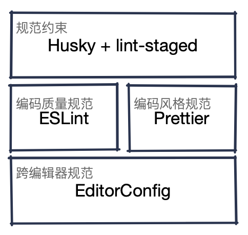

- # 编码规范概述
- 规范编码风格的优势
- 首先我们要定义一下什么是编码风格。我们往往把不涉及到对错，但因人而异的编码习惯称之为编码风格。诸如以下的例子：
- ```JavaScript
  // 对于引号的使用
  const quote1 = "double"
  const quote2 = 'single'
  
  // 尾逗号的使用
  const comma1 = [1, 2, 3]
  const comma1 = [1, 2, 3,]
  
  // 箭头函数参数是否始终被括号包裹
  const arrow1 = (arg) => {}
  const arrow1 = arg => {}
  ```
- 代码风格的千人千变会从根本上降低代码的**可读性**、**可维护性**，从而**提高开发成本**，想必每个开发者都经历过不同操作系统换行符的替换导致的 Git 全量 Diff。
- 统一的编码风格提升了整个项目交付效率，甚至在 code review 阶段也可以忽略对风格的争议，把精力投入到代码质量提升、工程化等其他地方。
-
- ### 规范编码质量的优势
- 同样我们首先要定义一下什么是编码质量。编码质量不一定意味着错误，我们往往把可能的错误或逻辑错误都归类为编码质量问题，诸如以下的示例：
- ```JavaScript
  // 禁止对 function 声明重新赋值
  function fn() { /* do sth */ }
  fn = "string" // ×
  
  // 要求使用 isNaN() 检查 NaN
  if (foo == NaN) {} // ×
  if (isNaN(foo)) {} // √
  
  // 要求使用 === 和 !==
  if (bool1 == true) {} // ×
  if (bool2 === true) {} // √
  ```
- 编码质量问题不一定会引起系统故障，甚至大多数 hack 代码也会被归类为编码质量问题中。所以针对编码质量我们不能一竿子打死，在常规业务代码中对编码质量的规范能够有效降低潜在的错误风险，而在特定的复杂模块、组件中我们可以选择局部禁用编码质量规范。
- 统一规范的编码质量虽然会扼杀一些“富有创意性”的代码，但从项目的角度来说有助于团队尽早发现问题，甚至在 lint 阶段完全预防问题的发生。
-
- ### 规范的制定与遵守
-
-
- # 规范的实现
- {:height 302, :width 252}
- collapsed:: true
  1. EditorConfig
	- EditorConfig 可以在编辑器或 IDE 层面抹除一部分基础的差异，仅仅需要一个配置文件即可。
	- 根据官网查找自己使用的编辑器是否内建支持或需要下载插件 [pre-installed](https://editorconfig.org/#pre-installed), [download-plugin](https://editorconfig.org/#download)。
	- 配置文件如下，增加了参数的注释，对部分参数解释了 format 的触发时机及是否使用的取舍：
	- ``` sh
	  # EditorConfig is awesome: https://EditorConfig.org
	  # Check properties set supporting on https://github.com/editorconfig/editorconfig/wiki/EditorConfig-Properties
	  
	  # top-most EditorConfig file
	  root = true
	  
	  [*]
	  
	  # Indentation Style
	  # The values are case insensitive. They will be lowercased by the core library.
	  # https://github.com/editorconfig/editorconfig/wiki/EditorConfig-Properties#indent_style
	  indent_style = space
	  
	  # Indentation Size (in single-spaced characters)
	  # The values are case insensitive. They will be lowercased by the core library.
	  # https://github.com/editorconfig/editorconfig/wiki/EditorConfig-Properties#indent_size
	  indent_size = 2
	  
	  # Width of a single tabstop character
	  # https://github.com/editorconfig/editorconfig/wiki/EditorConfig-Properties#tab_width
	  # Only use this property when if you want to work with tabs, and change indent_style into 'tab'
	  # tab_width = 4 # defaults indent_size when indent_size is a number
	  
	  # Line ending file format (Unix, DOS, Mac)
	  # The values are case insensitive. They will be lowercased by the core library.
	  # NOTE: if you want to use native line endings between different operating systems it is better not to set this option and leave that task to the VCS! In the future we might add a value like native for this scenario (cf #226).
	  # https://github.com/editorconfig/editorconfig/wiki/EditorConfig-Properties#end_of_line
	  # end_of_line = LEAN_ON_VCS(DON'T SET)
	  
	  # Denotes whether file should end with a newline
	  # The values are case insensitive. They will be lowercased by the core library.
	  # https://github.com/editorconfig/editorconfig/wiki/EditorConfig-Properties#insert_final_newline
	  insert_final_newline = true # on save only
	  
	  # Denotes whether whitespace is removed from the end of lines
	  # The values are case insensitive. They will be lowercased by the core library.
	  # https://github.com/editorconfig/editorconfig/wiki/EditorConfig-Properties#trim_trailing_whitespace
	  trim_trailing_whitespace = true # on save only
	  
	  # File character encoding
	  # The values are case insensitive. They will be lowercased by the core library.
	  # https://github.com/editorconfig/editorconfig/wiki/EditorConfig-Properties#charset
	  # https://github.com/editorconfig/editorconfig/wiki/Character-Set-Support
	  charset = utf-8 # on the backlog
	  
	  ```
-
- collapsed:: true
  2. ESLint
	- 随着版本的更迭，如今的 ESLint 已经不仅仅是一个编码质量维护工具了，官方也提供了大量的编码风格相关的选项。甚至也不是仅适用于 .js 文件，对 .vue、.html 等文件也有插件支持。
	- 但在多数文件类型的支持上仍然不如 Prettier 全面，为了避免冲突，我们仅使用 ESLint 中编码质量的选项。
	- 虽然我们可以通过 `extends` 来方便地应用 ESLint 的多种推荐组合，但我们仍然选择使用 `rules` 来逐条构建我们的编码规范，原因如下：
	- * 通过 `extends` 引入的组合不直观，编辑取舍不方便，且部分 `plugin:{platform}/{type}` 形式的引入的组合随着依赖的更新有可能导致项目被注入额外的 lint 选项，排查会非常麻烦，造成开发中的困扰。
	  * 手动在 `rules` 中编辑的选项比较稳定，仅存在 `deprecated` 的风险(周期很长)。且可以逐条加上必要的注释，对某单一约束的启停非常方便。且所有的变动都会进入版本控制中，变更历史一目了然。
	- `.eslintrc.js` 文件如下所示:
	- ```JavaScript
	  module.exports = {
	    root: true,
	    env: {
	      browser: true,
	      node: true,
	      es6: true,
	    },
	    globals: {
	      wx: true,
	    },
	    plugins: ["prettier"],
	    extends: [
	      "plugin:vue/essential",
	      // 'eslint:recommended'
	      "prettier",
	    ],
	    parserOptions: {
	      parser: "@babel/eslint-parser",
	    },
	    rules: {
	      "prettier/prettier": "error",
	      /*
	       * ********************************************************************
	       * eslint:recommended 重写
	       * ********************************************************************
	       */
	  
	      // 开发环境可以使用 console
	      "no-console": process.env.NODE_ENV === "production" ? "error" : "off",
	      // 开发环境可以使用 debugger
	      "no-debugger": process.env.NODE_ENV === "production" ? "error" : "off",
	  
	      /*
	       * ********************************************************************
	       * Possible Errors 逻辑纠错
	       * ********************************************************************
	       * -------------------------
	       * -------- fixable --------
	       * -------------------------
	       */
	  
	      /*
	       * ------------------------
	       * --- can not be fixed ---
	       * ------------------------
	       */
	      "no-func-assign": "error",
	  
	      /*
	       * ********************************************************************
	       * Best Practices 最佳实践
	       * ********************************************************************
	       * -------------------------
	       * -------- fixable --------
	       * -------------------------
	       */
	  
	      // 在块区域前后时刻保留大括号
	      "curly": "error",
	      // 禁止不必要的函数绑定
	      "no-extra-bind": "error",
	      // 禁止浮点小数
	      "no-floating-decimal": "error",
	      // 禁止出现多个空格
	      "no-multi-spaces": "error",
	  
	      /*
	       * ------------------------
	       * --- can not be fixed ---
	       * ------------------------
	       */
	  
	      /*
	       * 使用类型安全的 === 和 !== 操作符代替 == 和 != 操作符
	       * 不对 null 应用此规则
	       */
	      "eqeqeq": ["error", "always", { "null": "ignore" }],
	      // 要求 Switch 语句中有 Default 分支
	      "default-case": "error",
	      // 禁用 caller 或 callee
	      "no-caller": "error",
	      // 禁用 eval()
	      "no-eval": "error",
	      // 禁用隐式的eval()
	      "no-implied-eval": "error",
	      // 禁止在返回语句中赋值
	      "no-return-assign": "error",
	      // 禁止自身比较
	      "no-self-compare": "error",
	      // 禁用 with 语句
	      "no-with": "error",
	  
	      /*
	       * ********************************************************************
	       * Stylistic Issues 代码风格
	       * ********************************************************************
	       * -------------------------
	       * -------- fixable --------
	       * -------------------------
	       */
	  
	      // 缩进2位, 在.vue文件中script标签特殊处理
	      "indent": "off",
	      /* !!!!!!!!!! 使用 Prettier 设置替代 !!!!!!!!!! */
	      // "vue/script-indent": ["error", 2, { "baseIndent": 1 }],
	      // 在代码块中使用一致的大括号风格(one true brace style 风格)
	      "brace-style": ["error", "1tbs", { "allowSingleLine": true }],
	      // 在部分代码中禁止使用拖尾逗号
	      /* !!!!!!!!!! 使用 Prettier 设置替代 !!!!!!!!!! */
	      // "comma-dangle": ["error", {
	      //   "arrays": "never",
	      //   "objects": "never",
	      //   "imports": "never",
	      //   "exports": "never"
	      // }],
	      // 在逗号周围使用空格
	      "comma-spacing": ["error", { "before": false, "after": true }],
	      // 要求逗号放在数组元素、对象属性或变量声明之后，且在同一行
	      "comma-style": ["error", "last"],
	      // 要求文件末尾保留一行空行, 为可能的 Unix shell 环境做准备
	      "eol-last": ["error", "always"],
	      // 禁止在函数标识符和其调用之间有空格
	      "func-call-spacing": ["error", "never"],
	      // 如果函数的任一参数有换行，则要求在函数括号内换行, 否则禁止换行
	      "function-paren-newline": ["error", "multiline"],
	      // 禁止在箭头函数体之前出现换行
	      "implicit-arrow-linebreak": ["error", "beside"],
	      // 禁止在对象字面量的键和冒号之间存在空格, 要求在对象字面量的冒号和值之间存在至少有一个空格
	      "key-spacing": ["error", { "beforeColon": false, "afterColon": true }],
	      // 要求在关键字之前至少有一个空格, 要求在关键字之后至少有一个空格 (if, for, while)
	      "keyword-spacing": ["error", { "before": true, "after": true }],
	      // 强制使用 Unix 换行符： \n
	      // "linebreak-style": ["error", "unix"],
	      // 禁止使用连续的行注释来表示块注释。另外，要求块注释的每行之前有一个 *
	      // "multiline-comment-style": ["error", "starred-block"],
	      // 要求调用无参构造函数时带括号
	      "new-parens": "error",
	      // 禁止 if 语句作为唯一语句出现在 else 语句块中
	      "no-lonely-if": "error",
	      // 禁止混合使用不同的操作符, 使用()来分隔不同的操作符
	      // "no-mixed-operators": "error",
	      // 强制最大连续空行数为1
	      "no-multiple-empty-lines": ["error", { "max": 1 }],
	      // 禁止可以表达为更简单结构的三元操作符
	      "no-unneeded-ternary": "error",
	      // 禁止属性前有空白
	      "no-whitespace-before-property": "error",
	      // 禁止单行语句之前有换行 (if、else、while、do-while 和 for)
	      "nonblock-statement-body-position": ["error", "beside"],
	      // 要求花括号内有空格 (除了 {})
	      "object-curly-spacing": ["error", "always"],
	      // 尽可能地简化赋值操作 (例如，x = x + 4 可以简化为 x += 4)
	      "operator-assignment": ["error", "always"],
	      // 禁止块语句和类的开始或末尾有空行
	      "padded-blocks": ["error", "never"],
	      // 块语句必须总是至少有一个前置空格
	      "space-before-blocks": ["error", "always"],
	      /*
	       * 要求尽可能地使用双引号
	       * 允许字符串使用反勾号
	       */
	      /* !!!!!!!!!! 使用 Prettier 设置替代 !!!!!!!!!! */
	      // "quotes": ["error", "double", { "allowTemplateLiterals": true }],
	      // 要求函数圆括号之前有一个空格
	      /* !!!!!!!!!! 使用 Prettier 设置替代 !!!!!!!!!! */
	      // "space-before-function-paren": ["error", {
	      //   "anonymous": "always",
	      //   "named": "always",
	      //   "asyncArrow": "always"
	      // }],
	      // 强制圆括号内没有空格
	      "space-in-parens": ["error", "never"],
	      // 要求在注释前有空白 // 或 /* 必须跟随至少一个空白
	      "spaced-comment": ["error", "always"],
	      // 要求冒号之后有一个或多个空格, 禁止冒号之前有空格
	      "switch-colon-spacing": ["error", { "after": true, "before": false }],
	      // 要求正则表达式被包裹起来
	      "wrap-regex": "error",
	      // 强制在代码块中开括号前和闭括号后有空格
	      "block-spacing": "error",
	  
	      /*
	       * ------------------------
	       * --- can not be fixed ---
	       * ------------------------
	       */
	  
	      // 使用骆驼拼写法
	      // "camelcase": ["error", {"properties": "always"}],
	      // 要求一致的 This 别名
	      "consistent-this": ["error", "self"],
	      // 强制行注释只在代码上方，单独成行
	      // "line-comment-position": ["error", {"position": "above"}],
	      // 强制块语句的最大可嵌套3层
	      "max-depth": ["error", 6],
	      // 强制回调函数最大可嵌套3层
	      "max-nested-callbacks": ["error", 3],
	      // 如果表达式跨越多个行，则在三元表达式的操作数之间强制换行
	      "multiline-ternary": ["error", "always-multiline"],
	      /*
	       * 要求调用 new 操作符时有首字母大小的函数
	       * 要求调用首字母大写的函数时有 new 操作符
	       * 检查对象属性
	       */
	      "new-cap": ["off", { "newIsCap": true, "capIsNew": true, "properties": true }],
	      // 禁止连续赋值
	      "no-multi-assign": "error",
	      // 禁用for...in,
	      "no-restricted-syntax": ["error", "ForInStatement"],
	  
	      /*
	       * ********************************************************************
	       * ECMAScript 6
	       * ********************************************************************
	       * -------------------------
	       * -------- fixable --------
	       * -------------------------
	       */
	  
	      // 要求箭头函数体使用大括号
	      "arrow-body-style": ["error", "always"],
	      // 要求箭头函数的参数使用圆括号
	      /* !!!!!!!!!! 使用 Prettier 设置替代 !!!!!!!!!! */
	      // "arrow-parens": ["error", "always"],
	      // 要求箭头函数的箭头之前之后有空格
	      "arrow-spacing": ["error", { "before": true, "after": true }],
	      // 强制 generator 函数中 * 号前有空格, 后无空格 (function *generator() {})
	      "generator-star-spacing": ["error", { "before": true, "after": false }],
	      // 要求使用 let 或 const 而不是 var
	      "no-var": "error",
	      // 要求使用箭头函数作为回调
	      "prefer-arrow-callback": ["error", { "allowNamedFunctions": true }],
	      // 使用模板而非字符串连接 (`Hello, ${name}!`)
	      "prefer-template": "error",
	      // 强制在 yield* 表达式中 * 后使用空格
	      "yield-star-spacing": ["error", "after"],
	  
	      /*
	       * ------------------------
	       * --- can not be fixed ---
	       * ------------------------
	       */
	  
	      // 禁止重复导入
	      "no-duplicate-imports": "error",
	    },
	  }
	  ```
-
- collapsed:: true
  3. Prettier
	- Prettier 在语言支持上非常的广泛(`JavaScript`、`JSX`、`Angular`、`Vue`、`Flow`、`TypeScript`、`CSS/LESS/SASS`、`HTML`、`Ember/Handlebars`、`JSON`、`GraphQL`、`Markdown`、`YAML`)，可以说是完全覆盖了常规的前端开发。
	- > Prettier is an opinionated code formatter
	- 不过陈如官方所言，Prettier 是一个固执己见的格式化工具。它做的优化很多，由于 Prettier 和 ESLint 同属 AST 解析类的工具，他们都可以在确保代码功能一致性的前提下，大幅地更改代码的组织形式。但是 Prettier 提供的可配置选项不能完全覆盖它所能做的所有修改，固执己见某种意义上也可以理解为自说自话。
	- 所以我们仅将 Prettier 配置来对 ESLint 无法处理的文件及一部分编码风格问题进行格式化。
	- .prettierrc.js 如下所示:
	- ```JavaScript
	  module.exports = {
	    // Specify the line length that the printer will wrap on.
	    // https://prettier.io/docs/en/options.html#print-width
	    // To avoid unnecessary wrapping, use a big number relative to default value
	    printWidth: 300,
	  
	    // Overridden by indent_style in .editorconfig file
	    // useTabs: false,
	  
	    // Print semicolons at the ends of statements.
	    // Only add semicolons at the beginning of lines that may introduce ASI failures.
	    // https://prettier.io/docs/en/rationale.html#semicolons
	    semi: false,
	  
	    // Use single quotes instead of double quotes.
	    // https://prettier.io/docs/en/options.html#quotes
	    singleQuote: false,
	  
	    // Change when properties in objects are quoted.
	    // https://prettier.io/docs/en/options.html#quote-props
	    quoteProps: "preserve",
	  
	    // Print trailing commas wherever possible in multi-line comma-separated syntactic structures. (A single-line array, for example, never gets trailing commas.)
	    // https://prettier.io/docs/en/options.html#trailing-commas
	    trailingComma: "es5",
	  
	    // Print spaces between brackets in object literals.
	    // https://prettier.io/docs/en/options.html#bracket-spacing
	    bracketSpacing: true,
	  
	    // Put the > of a multi-line HTML (HTML, JSX, Vue, Angular) element at the end of the last line instead of being alone on the next line (does not apply to self closing elements).
	    // https://prettier.io/docs/en/options.html#bracket-line
	    bracketSameLine: true,
	  
	    // Include parentheses around a sole arrow function parameter.
	    // https://prettier.io/docs/en/options.html#arrow-function-parentheses
	    arrowParens: "always",
	  
	    // Format whole file.
	    // https://prettier.io/docs/en/options.html#range
	    rangeStart: 0,
	    rangeEnd: Infinity,
	  
	    // Specify the global whitespace sensitivity for HTML, Vue, Angular, and Handlebars. See whitespace-sensitive formatting for more info.
	    // https://prettier.io/docs/en/options.html#html-whitespace-sensitivity
	    htmlWhitespaceSensitivity: "css",
	  
	    // Whether or not to indent the code inside <script> and <style> tags in Vue files. Some people (like the creator of Vue) don’t indent to save an indentation level, but this might break code folding in your editor.
	    // https://prettier.io/docs/en/options.html#vue-files-script-and-style-tags-indentation
	    vueIndentScriptAndStyle: false,
	  
	    // Follow Linux & MacOS
	    endOfLine: "lf",
	  
	    // Enforce single attribute per line in HTML, Vue and JSX.
	    // https://prettier.io/docs/en/options.html#single-attribute-per-line
	    singleAttributePerLine: false,
	  }
	  
	  ```
-
- ## 规范在项目中的落地
- ### 关于 ESLint 与 Prettier 的融合
- 在同一个项目中同时使用两种 format 方式是无法接收的，且无法配置在保存自动修复中。
- 1. eslint-config-prettier
	- 我们可以通过该插件来关闭 ESLint 中不必要的、可能会与 Prettier 产生冲突的选项。
	- ```sh
	  # Install
	  npm install --save-dev eslint-config-prettier
	  
	  # Config .eslintrc.* file
	  {
	    "extends": [
	      "some-other-config-you-use",
	      "prettier"
	    ]
	  }
	  ```
	- 要注意的是，该插件对 ESLint 中 `rules` 的配置项是不起效果的。理论上我们的规范设计是不需要该插件的，但考虑到编码规范是随着项目开发演进的，不同的项目可能配置不同的规范，可能升级也可能降级。在使用 `extends` 引入组合的情况下(很常见)，`eslint-config-prettier` 就能发挥它应有的功能了。
- 2. eslint-plugin-prettier
	- 由于 ESLint 和 Prettier 的工作原理很类似，都依赖语法树对代码进行分析，存在规则合并的可能性。该插件将 Prettier 定义的规则以 ESLint 的方式整合到一起，通过 ESLint 完成两者所有的规范检查。
	- 安装配置如下：
	- ```JavaScript
	  // Install
	  npm install --save-dev eslint-config-prettier
	  
	  // Recommended config in .eslintrc.* file.
	  {
	    "extends": ["plugin:prettier/recommended"]
	  }
	  // Or a normal config in .eslintrc.* file, it does a same thing.
	  {
	    "extends": ["prettier"],
	    "plugins": ["prettier"],
	    "rules": {
	      "prettier/prettier": "error",
	      "arrow-body-style": "off",
	      "prefer-arrow-callback": "off"
	    }
	  }
	  ```
-
- ### 关于保存自动修复(Auto Fix on Save)
- 在 VSCode [插件市场](https://marketplace.visualstudio.com/items?itemName=dbaeumer.vscode-eslint)中 ESLint Release Notes 中有如下设置项的变更：
- > Improved Auto Fix on Save - Auto Fix on Save is now part of VS Code's Code Action on Save infrastructure and computes all possible fixes in one round. It is customized via the  `editor.codeActionsOnSave`  setting. The setting supports the ESLint specific property  `source.fixAll.eslint` . The extension also respects the generic property  `source.fixAll` .
- 使用高于 Version 2.0.4 版本的 ESLint 插件时，需要对 VSCode 设置项做如下配置，并删除旧有的保存自动修复配置才能在保存时自动使用 ESLint 配置去修复代码。
- ```JSON
  // Turn on auto fix by ESLint or selectively disable ESLint
  "editor.codeActionsOnSave": {
    "source.fixAll.eslint": true
  }
  "editor.codeActionsOnSave": {
    "source.fixAll": true,
    "source.fixAll.eslint": false
  }
  ```
-
- ## 利用 Husky 提供本地 pre-commit 编码检查
- ### 安装及初始化 Husky
- ```shell
  // 安装 Husky
  npm install husky --save-dev
  // 初始化 Husky，创建 .husky/pre-commit 文件
  npx husky-init install
  
  // .husky/pre-commit 文件中添加 eslint 命令
  npm run eslint-fix
  ```
-
- ### 环境问题
- 如果使用 Git 管理软件，可能会遇到环境问题，在提交代码时抛出如下错误：
- ```shell
  .husky/pre-commit: line 8: npm: command not found
  ```
- 这是因为这类 GUI 工具自身的环境变量可能比用户态环境变量少一些。可以在 `pre-commit` 文件中添加 `echo $PATH`，然后在提交中确认一下。
- 可以通过两个方案解决，但是由于环境变量在每个开发者的机器上都不尽相同，请遇到问题的伙伴自行选择：
- 1. 官方在 [Troubleshoot/Command not found](https://typicode.github.io/husky/#/?id=command-not-found) 提供的修改根目录中 `.huskyrc.js` 配置文件方案。
  2. 可以在你需要修改的钩子文件，例如 `pre-commit` 中直接添加你需要的环境变量 `PATH="/usr/local/bin:/usr/bin:/bin:/usr/sbin:/sbin:/Library/Apple/usr/bin:/Users/iiyumewo/.cargo/bin ..."`。
-
-
-
- # 对既有项目的测试
- 根据现有 ESLint + Prettier 对 `hz-new-media-web` 项目执行 lint&format，存在以下无法被自动修复的问题。
- ```shell
  /Users/iiyumewo/Documents/Projects/hz-new-media-web/src/components/Charts/bar.vue
    158:27  error  Unexpected chained assignment  no-multi-assign
  
  /Users/iiyumewo/Documents/Projects/hz-new-media-web/src/components/Charts/line.vue
    143:27  error  Unexpected chained assignment  no-multi-assign
  
  /Users/iiyumewo/Documents/Projects/hz-new-media-web/src/components/TimeSelectForm.vue
    110:36  warning  Expected '===' and instead saw '=='  eqeqeq
    110:70  warning  Expected '===' and instead saw '=='  eqeqeq
  
  /Users/iiyumewo/Documents/Projects/hz-new-media-web/src/components/TreeSelectMore.vue
    186:27   warning  Expected '!==' and instead saw '!='                   eqeqeq
    189:80   warning  Expected '!==' and instead saw '!='                   eqeqeq
    190:86   warning  Expected '!==' and instead saw '!='                   eqeqeq
    193:93   warning  Expected '!==' and instead saw '!='                   eqeqeq
    193:171  warning  Expected '!==' and instead saw '!='                   eqeqeq
    205:11   error    Unexpected if as the only statement in an else block  no-lonely-if
    205:81   warning  Expected '!==' and instead saw '!='                   eqeqeq
    205:156  warning  Expected '!==' and instead saw '!='                   eqeqeq
    205:231  warning  Expected '!==' and instead saw '!='                   eqeqeq
  
  /Users/iiyumewo/Documents/Projects/hz-new-media-web/src/components/ueditor/index.vue
    106:13  error  Unexpected alias '_this' for 'this'  consistent-this
  
  /Users/iiyumewo/Documents/Projects/hz-new-media-web/src/modules/binduser/binduser.router.js
    2:1  error  './index.vue' import is duplicated  no-duplicate-imports
  
  /Users/iiyumewo/Documents/Projects/hz-new-media-web/src/modules/feelings/index.vue
    155:13  error  Assignment (=) can be replaced with operator assignment (-=)  operator-assignment
  
  /Users/iiyumewo/Documents/Projects/hz-new-media-web/src/modules/media-monitor/charts/pie.vue
    69:25  error  Unexpected chained assignment  no-multi-assign
  
  /Users/iiyumewo/Documents/Projects/hz-new-media-web/src/modules/media-monitor/request/index.js
    6:11  error  Unexpected alias 'context' for 'this'  consistent-this
  
  /Users/iiyumewo/Documents/Projects/hz-new-media-web/src/modules/media-monitor/statement/index.vue
    182:9  error  Parsing error: Unexpected token, expected "," (115:9)
  
  /Users/iiyumewo/Documents/Projects/hz-new-media-web/src/modules/media-monitor/views/BaseMixin.js
    12:7  error  Unexpected if as the only statement in an else block  no-lonely-if
  
  /Users/iiyumewo/Documents/Projects/hz-new-media-web/src/modules/media-monitor/views/toutiao/Privacy.vue
    320:28  error  Parsing error: Missing semicolon. (199:28)
  
  /Users/iiyumewo/Documents/Projects/hz-new-media-web/src/modules/media-monitor/views/toutiao/Update.vue
    245:13  warning  Expected '===' and instead saw '=='  eqeqeq
  
  /Users/iiyumewo/Documents/Projects/hz-new-media-web/src/modules/media-monitor/views/toutiao/WrongWords.vue
    442:29  warning  Expected '===' and instead saw '=='  eqeqeq
    442:52  warning  Expected '===' and instead saw '=='  eqeqeq
  
  /Users/iiyumewo/Documents/Projects/hz-new-media-web/src/modules/media-monitor/views/wechat/WrongWords.vue
    202:1   error    '@/utils' import is duplicated       no-duplicate-imports
    394:29  warning  Expected '===' and instead saw '=='  eqeqeq
    394:57  warning  Expected '===' and instead saw '=='  eqeqeq
  
  /Users/iiyumewo/Documents/Projects/hz-new-media-web/src/modules/media-monitor/views/weibo/Update.vue
    200:13  warning  Expected '===' and instead saw '=='  eqeqeq
  
  /Users/iiyumewo/Documents/Projects/hz-new-media-web/src/modules/media-monitor/views/weibo/WrongWords.vue
    412:29  warning  Expected '===' and instead saw '=='  eqeqeq
    412:52  warning  Expected '===' and instead saw '=='  eqeqeq
  
  /Users/iiyumewo/Documents/Projects/hz-new-media-web/src/modules/message-interaction/keyword-reply/index.vue
    144:13  error  Assignment (=) can be replaced with operator assignment (-=)  operator-assignment
  
  /Users/iiyumewo/Documents/Projects/hz-new-media-web/src/modules/message-interaction/reply-news/addNews.vue
    473:7  error  Assignment (=) can be replaced with operator assignment (+=)  operator-assignment
    476:9  error  Assignment (=) can be replaced with operator assignment (-=)  operator-assignment
  
  /Users/iiyumewo/Documents/Projects/hz-new-media-web/src/modules/message-interaction/reply-text/index.vue
    124:13  error  Assignment (=) can be replaced with operator assignment (-=)  operator-assignment
  
  /Users/iiyumewo/Documents/Projects/hz-new-media-web/src/modules/monitoring/site/index.vue
    42:11  error  Unexpected alias '_this' for 'this'  consistent-this
  
  /Users/iiyumewo/Documents/Projects/hz-new-media-web/src/modules/new-media/account/availability/edit.vue
    144:30  warning  Expected '===' and instead saw '=='  eqeqeq
  
  /Users/iiyumewo/Documents/Projects/hz-new-media-web/src/modules/new-media/account/availability/index.vue
    153:13  error  Assignment (=) can be replaced with operator assignment (-=)  operator-assignment
  
  /Users/iiyumewo/Documents/Projects/hz-new-media-web/src/modules/new-media/account/other/index.vue
    257:13  error  Assignment (=) can be replaced with operator assignment (-=)  operator-assignment
  
  /Users/iiyumewo/Documents/Projects/hz-new-media-web/src/modules/new-media/account/toutiao/index.vue
    185:13  error  Assignment (=) can be replaced with operator assignment (-=)  operator-assignment
  
  /Users/iiyumewo/Documents/Projects/hz-new-media-web/src/modules/new-media/account/website/config/index.vue
    320:7  warning  Expected a default case  default-case
  
  /Users/iiyumewo/Documents/Projects/hz-new-media-web/src/modules/new-media/account/website/index.vue
    148:13  error  Assignment (=) can be replaced with operator assignment (-=)  operator-assignment
  
  /Users/iiyumewo/Documents/Projects/hz-new-media-web/src/modules/new-media/account/wechat/index.vue
    204:13  error  Assignment (=) can be replaced with operator assignment (-=)  operator-assignment
  
  /Users/iiyumewo/Documents/Projects/hz-new-media-web/src/modules/new-media/account/weibo/edit.vue
    84:1  error  '../../../../utils' import is duplicated  no-duplicate-imports
  
  /Users/iiyumewo/Documents/Projects/hz-new-media-web/src/modules/new-media/account/weibo/index.vue
    179:13  error  Assignment (=) can be replaced with operator assignment (-=)  operator-assignment
  
  /Users/iiyumewo/Documents/Projects/hz-new-media-web/src/modules/new-media/declare/expage/index.vue
    118:13  error  Assignment (=) can be replaced with operator assignment (-=)  operator-assignment
  
  /Users/iiyumewo/Documents/Projects/hz-new-media-web/src/modules/new-media/declare/wechat/index.vue
    270:15  error  Assignment (=) can be replaced with operator assignment (-=)  operator-assignment
  
  /Users/iiyumewo/Documents/Projects/hz-new-media-web/src/modules/new-media/declare/weibo/index.vue
    262:15  error  Assignment (=) can be replaced with operator assignment (-=)  operator-assignment
  
  /Users/iiyumewo/Documents/Projects/hz-new-media-web/src/modules/new-media/lexicon/custom/category/index.vue
    113:13  error  Assignment (=) can be replaced with operator assignment (-=)  operator-assignment
  
  /Users/iiyumewo/Documents/Projects/hz-new-media-web/src/modules/new-media/lexicon/custom/sensitivity/index.vue
    154:13  error  Assignment (=) can be replaced with operator assignment (-=)  operator-assignment
  
  /Users/iiyumewo/Documents/Projects/hz-new-media-web/src/modules/new-media/lexicon/custom/wrongly/index.vue
    170:13  error  Assignment (=) can be replaced with operator assignment (-=)  operator-assignment
  
  /Users/iiyumewo/Documents/Projects/hz-new-media-web/src/modules/new-media/lexicon/library/category/index.vue
    108:13  error  Assignment (=) can be replaced with operator assignment (-=)  operator-assignment
  
  /Users/iiyumewo/Documents/Projects/hz-new-media-web/src/modules/new-media/media/audio/edit.vue
    239:8  error  Parsing error: Unexpected token, expected "," (183:8)
  
  /Users/iiyumewo/Documents/Projects/hz-new-media-web/src/modules/new-media/media/audio/myAudio.vue
    151:13  error  Assignment (=) can be replaced with operator assignment (-=)  operator-assignment
  
  /Users/iiyumewo/Documents/Projects/hz-new-media-web/src/modules/new-media/media/audio/publishAudio.vue
    152:11  error  Assignment (=) can be replaced with operator assignment (-=)  operator-assignment
  
  /Users/iiyumewo/Documents/Projects/hz-new-media-web/src/modules/new-media/media/image/myImage.vue
    158:13  error  Assignment (=) can be replaced with operator assignment (-=)  operator-assignment
  
  /Users/iiyumewo/Documents/Projects/hz-new-media-web/src/modules/new-media/media/image/publishImage.vue
    156:13  error  Assignment (=) can be replaced with operator assignment (-=)  operator-assignment
  
  /Users/iiyumewo/Documents/Projects/hz-new-media-web/src/modules/new-media/media/mediaTheme/index.vue
    118:11  error  Assignment (=) can be replaced with operator assignment (-=)  operator-assignment
  
  /Users/iiyumewo/Documents/Projects/hz-new-media-web/src/modules/new-media/media/news/addNews.vue
     645:16  warning  Expected '===' and instead saw '=='       eqeqeq
     650:25  warning  Expected '===' and instead saw '=='       eqeqeq
    1158:11  error    Unexpected var, use let or const instead  no-var
  
  /Users/iiyumewo/Documents/Projects/hz-new-media-web/src/modules/new-media/media/news/depot.vue
    234:15  error  Assignment (=) can be replaced with operator assignment (-=)  operator-assignment
  
  /Users/iiyumewo/Documents/Projects/hz-new-media-web/src/modules/new-media/media/news/selectAccount.vue
    151:27  warning  Expected '===' and instead saw '=='  eqeqeq
    265:29  warning  Expected '===' and instead saw '=='  eqeqeq
  
  /Users/iiyumewo/Documents/Projects/hz-new-media-web/src/modules/new-media/media/publishHistore/index.vue
    69:15  error  Assignment (=) can be replaced with operator assignment (-=)  operator-assignment
  
  /Users/iiyumewo/Documents/Projects/hz-new-media-web/src/modules/new-media/media/templates/index.vue
    127:13  error  Assignment (=) can be replaced with operator assignment (-=)  operator-assignment
  
  /Users/iiyumewo/Documents/Projects/hz-new-media-web/src/modules/new-media/monitor/components/TypoMonitorModal.vue
    271:14  error  Parsing error: Unexpected token (203:14)
  
  /Users/iiyumewo/Documents/Projects/hz-new-media-web/src/modules/new-media/performance/release/index.vue
    165:19  warning  Expected '===' and instead saw '=='  eqeqeq
    169:19  warning  Expected '===' and instead saw '=='  eqeqeq
    173:19  warning  Expected '===' and instead saw '=='  eqeqeq
    177:19  warning  Expected '===' and instead saw '=='  eqeqeq
    181:19  warning  Expected '===' and instead saw '=='  eqeqeq
    185:19  warning  Expected '===' and instead saw '=='  eqeqeq
  
  /Users/iiyumewo/Documents/Projects/hz-new-media-web/src/modules/new-media/performance/statistics/index.vue
    222:19  warning  Expected '===' and instead saw '=='  eqeqeq
    226:19  warning  Expected '===' and instead saw '=='  eqeqeq
    230:19  warning  Expected '===' and instead saw '=='  eqeqeq
    234:19  warning  Expected '===' and instead saw '=='  eqeqeq
    238:19  warning  Expected '===' and instead saw '=='  eqeqeq
    242:19  warning  Expected '===' and instead saw '=='  eqeqeq
  
  /Users/iiyumewo/Documents/Projects/hz-new-media-web/src/modules/new-media/publish/microblog/index.vue
    232:7   warning  Expected a default case              default-case
    233:38  warning  Expected '===' and instead saw '=='  eqeqeq
    237:38  warning  Expected '===' and instead saw '=='  eqeqeq
    241:38  warning  Expected '===' and instead saw '=='  eqeqeq
    245:38  warning  Expected '===' and instead saw '=='  eqeqeq
    249:38  warning  Expected '===' and instead saw '=='  eqeqeq
  
  /Users/iiyumewo/Documents/Projects/hz-new-media-web/src/modules/new-media/publish/wechat/index.vue
    233:7   warning  Expected a default case              default-case
    234:38  warning  Expected '===' and instead saw '=='  eqeqeq
    238:38  warning  Expected '===' and instead saw '=='  eqeqeq
    242:38  warning  Expected '===' and instead saw '=='  eqeqeq
    246:38  warning  Expected '===' and instead saw '=='  eqeqeq
    250:38  warning  Expected '===' and instead saw '=='  eqeqeq
  
  /Users/iiyumewo/Documents/Projects/hz-new-media-web/src/modules/new-media/reports/bigScreen/components/Account/AccountTop10List.vue
    165:28  error  Unexpected chained assignment  no-multi-assign
    165:45  error  Unexpected chained assignment  no-multi-assign
    165:62  error  Unexpected chained assignment  no-multi-assign
    165:79  error  Unexpected chained assignment  no-multi-assign
    228:28  error  Unexpected chained assignment  no-multi-assign
    228:45  error  Unexpected chained assignment  no-multi-assign
    228:62  error  Unexpected chained assignment  no-multi-assign
    228:79  error  Unexpected chained assignment  no-multi-assign
  
  /Users/iiyumewo/Documents/Projects/hz-new-media-web/src/modules/new-media/reports/survey/index.vue
    153:29  error  Parsing error: Unexpected token, expected "," (89:29)
  
  /Users/iiyumewo/Documents/Projects/hz-new-media-web/src/modules/officialMenu/menu.vue
     667:11  error    Unexpected alias '_zhat' for 'this'  consistent-this
    1555:20  warning  Expected '===' and instead saw '=='  eqeqeq
    1556:28  warning  Expected '===' and instead saw '=='  eqeqeq
    1557:30  warning  Expected '===' and instead saw '=='  eqeqeq
    1558:22  warning  Expected '===' and instead saw '=='  eqeqeq
    1559:21  warning  Expected '===' and instead saw '=='  eqeqeq
    1560:37  warning  Expected '===' and instead saw '=='  eqeqeq
    1561:34  warning  Expected '===' and instead saw '=='  eqeqeq
    1562:32  warning  Expected '===' and instead saw '=='  eqeqeq
    1563:33  warning  Expected '===' and instead saw '=='  eqeqeq
    1564:31  warning  Expected '===' and instead saw '=='  eqeqeq
    1565:38  warning  Expected '===' and instead saw '=='  eqeqeq
    1566:39  warning  Expected '===' and instead saw '=='  eqeqeq
    1567:53  warning  Expected '===' and instead saw '=='  eqeqeq
    1568:47  warning  Expected '===' and instead saw '=='  eqeqeq
    1569:38  warning  Expected '===' and instead saw '=='  eqeqeq
    1570:44  warning  Expected '===' and instead saw '=='  eqeqeq
    1571:46  warning  Expected '===' and instead saw '=='  eqeqeq
    1572:37  warning  Expected '===' and instead saw '=='  eqeqeq
    1583:18  warning  Expected '===' and instead saw '=='  eqeqeq
    1584:26  warning  Expected '===' and instead saw '=='  eqeqeq
    1586:28  warning  Expected '===' and instead saw '=='  eqeqeq
    1587:20  warning  Expected '===' and instead saw '=='  eqeqeq
    1637:38  warning  Expected '===' and instead saw '=='  eqeqeq
    1639:45  warning  Expected '===' and instead saw '=='  eqeqeq
    1641:45  warning  Expected '===' and instead saw '=='  eqeqeq
    1643:45  warning  Expected '===' and instead saw '=='  eqeqeq
    1669:72  warning  Expected '===' and instead saw '=='  eqeqeq
    1672:72  warning  Expected '===' and instead saw '=='  eqeqeq
  
  /Users/iiyumewo/Documents/Projects/hz-new-media-web/src/modules/proof/ErrorContent.vue
     99:17  warning  Expected '===' and instead saw '=='  eqeqeq
    101:24  warning  Expected '===' and instead saw '=='  eqeqeq
    103:24  warning  Expected '===' and instead saw '=='  eqeqeq
  
  /Users/iiyumewo/Documents/Projects/hz-new-media-web/src/modules/proof/history.vue
    105:13  error  Assignment (=) can be replaced with operator assignment (-=)  operator-assignment
  
  /Users/iiyumewo/Documents/Projects/hz-new-media-web/src/modules/site-monitor/blankColumn.vue
    136:1  error  '@/utils/BaseUtil' import is duplicated  no-duplicate-imports
  
  /Users/iiyumewo/Documents/Projects/hz-new-media-web/src/modules/site-monitor/components/broken-chain.vue
    64:40  warning  Expected '===' and instead saw '=='  eqeqeq
  
  /Users/iiyumewo/Documents/Projects/hz-new-media-web/src/modules/site-monitor/components/dark-chain.vue
    58:40  warning  Expected '===' and instead saw '=='  eqeqeq
  
  /Users/iiyumewo/Documents/Projects/hz-new-media-web/src/modules/site-monitor/darkChainDetail.vue
    125:1  error  '@/utils/BaseUtil' import is duplicated  no-duplicate-imports
  
  /Users/iiyumewo/Documents/Projects/hz-new-media-web/src/modules/site-monitor/index.vue
    42:11  error  Unexpected alias '_this' for 'this'  consistent-this
  
  /Users/iiyumewo/Documents/Projects/hz-new-media-web/src/modules/site-monitor/linkAvailabilityDetail.vue
    120:1  error  '@/utils/BaseUtil' import is duplicated  no-duplicate-imports
  
  /Users/iiyumewo/Documents/Projects/hz-new-media-web/src/modules/site-monitor/mixins/page.js
    5:1  error  'vuex' import is duplicated  no-duplicate-imports
  
  /Users/iiyumewo/Documents/Projects/hz-new-media-web/src/modules/site-monitor/notUpdate.vue
    116:1  error  '@/utils/BaseUtil' import is duplicated  no-duplicate-imports
  
  /Users/iiyumewo/Documents/Projects/hz-new-media-web/src/modules/site-monitor/statement/index.vue
    176:9  error  Parsing error: Unexpected token, expected "," (109:9)
  
  /Users/iiyumewo/Documents/Projects/hz-new-media-web/src/modules/site-monitor/statement/statement.store.js
    47:29  warning  Expected '===' and instead saw '=='  eqeqeq
  
  /Users/iiyumewo/Documents/Projects/hz-new-media-web/src/modules/site-scanning/components/broken-chain.vue
    64:40  warning  Expected '===' and instead saw '=='  eqeqeq
  
  /Users/iiyumewo/Documents/Projects/hz-new-media-web/src/modules/site-scanning/components/dark-chain.vue
    61:40  warning  Expected '===' and instead saw '=='  eqeqeq
  
  /Users/iiyumewo/Documents/Projects/hz-new-media-web/src/modules/site-scanning/enclosure/index.vue
    431:29  warning  Expected '===' and instead saw '=='  eqeqeq
    431:52  warning  Expected '===' and instead saw '=='  eqeqeq
  
  /Users/iiyumewo/Documents/Projects/hz-new-media-web/src/modules/site-scanning/index.vue
    42:11  error  Unexpected alias '_this' for 'this'  consistent-this
  
  /Users/iiyumewo/Documents/Projects/hz-new-media-web/src/modules/site-scanning/linkAvailabilityDetail.vue
    155:1  error  '@/utils/BaseUtil' import is duplicated  no-duplicate-imports
  
  /Users/iiyumewo/Documents/Projects/hz-new-media-web/src/modules/site-scanning/mixins/page.js
    5:1  error  'vuex' import is duplicated  no-duplicate-imports
  
  /Users/iiyumewo/Documents/Projects/hz-new-media-web/src/modules/site-scanning/privacy/detail.vue
    231:12  error  Parsing error: Unexpected token (142:12)
  
  /Users/iiyumewo/Documents/Projects/hz-new-media-web/src/modules/system/home/Home.vue
    218:7   warning  Expected a default case              default-case
    219:38  warning  Expected '===' and instead saw '=='  eqeqeq
    223:38  warning  Expected '===' and instead saw '=='  eqeqeq
    227:38  warning  Expected '===' and instead saw '=='  eqeqeq
    231:38  warning  Expected '===' and instead saw '=='  eqeqeq
    235:38  warning  Expected '===' and instead saw '=='  eqeqeq
  
  /Users/iiyumewo/Documents/Projects/hz-new-media-web/src/modules/system/log/index.vue
    71:13  error  Assignment (=) can be replaced with operator assignment (-=)  operator-assignment
  
  /Users/iiyumewo/Documents/Projects/hz-new-media-web/src/modules/system/profile/message.vue
    116:25  warning  Expected '===' and instead saw '=='  eqeqeq
    118:32  warning  Expected '===' and instead saw '=='  eqeqeq
    120:32  warning  Expected '===' and instead saw '=='  eqeqeq
  
  /Users/iiyumewo/Documents/Projects/hz-new-media-web/src/modules/wechat/pages/warning/noupdate.vue
    54:46  warning  Expected '===' and instead saw '=='  eqeqeq
    61:46  warning  Expected '===' and instead saw '=='  eqeqeq
    73:33  warning  Expected '===' and instead saw '=='  eqeqeq
    76:40  warning  Expected '===' and instead saw '=='  eqeqeq
  
  /Users/iiyumewo/Documents/Projects/hz-new-media-web/src/request/index.js
    41:11  error  Unexpected alias '_this' for 'this'  consistent-this
  
  /Users/iiyumewo/Documents/Projects/hz-new-media-web/src/store/index.js
    6:1  error  '../utils/BaseUtil' import is duplicated  no-duplicate-imports
  
  /Users/iiyumewo/Documents/Projects/hz-new-media-web/src/utils/BaseUtil.js
     15:33  warning  Expected '===' and instead saw '=='  eqeqeq
     39:53  warning  Expected '===' and instead saw '=='  eqeqeq
    413:20  warning  Expected '===' and instead saw '=='  eqeqeq
    415:27  warning  Expected '===' and instead saw '=='  eqeqeq
    417:27  warning  Expected '===' and instead saw '=='  eqeqeq
    419:27  warning  Expected '===' and instead saw '=='  eqeqeq
  ```
-
- ### 分析结果
- ✖ 172 problems (67 errors, 105 warnings)
- *警告 warnings(不会在 pre-commit 阶段阻止流程)*：
	- **eqeqeq** 要求使用  `===`  和  `!==` : 101个
	- **default-case** 要求  `switch`  语句中有  `default`  分支 : 4个
- *errors(会在 Git hook 中抛出错误，且阻止 commit 执行)*:
	- **no-multi-assign** 禁止连续赋值  : 11个
	- **no-lonely-if** 禁止  `if`  作为唯一的语句出现在  `else`  语句中 : 2个
	- **consistent-this** 当获取当前执行环境的上下文时，强制使用一致的命名 : 7个
	- **no-duplicate-imports** 禁止重复模块导入 : 11个
	- **operator-assignment** 要求或禁止在可能的情况下使用简化的赋值操作符 : 28个
	- **unexpected-token** 语法逻辑致命错误 : 7个
	- **no-var** 要求使用  `let`  或  `const`  而不是  `var` : 1个
- 在如此规模的项目中，通过对规范一些合理的降级和妥协，将 `error` 的数量压缩在67个，这是一个人为修改可以接收的数字。如果是在一个新的项目中，诸如 `eqeqeq`、`default-case` 这类的规则就会被提升为 error 级别。
- 在 JavaScript 这样一个弱类型语言中，如果不引入 TypeScript 完善的类型系统，规范制定的原则就应该比较严格。团队开发的初期可能会花一些时间在适应规则上，但是从长远来看，这一切都是值得的，结果会体现在代码的质量，提交的效率，项目的稳定性上。
- # 提供体验项目
-
- lint-staged 本地暂存代码检查工具
- **commitizen** 辅助 commit 信息 ,就像这样,通过选择输入,规范提交信息