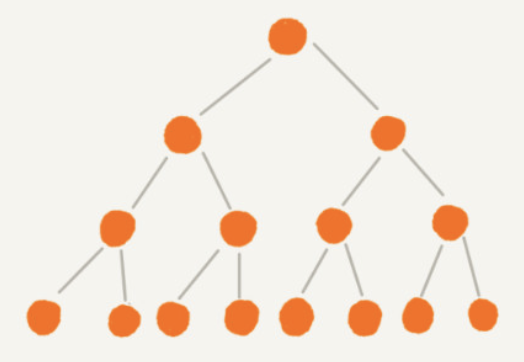
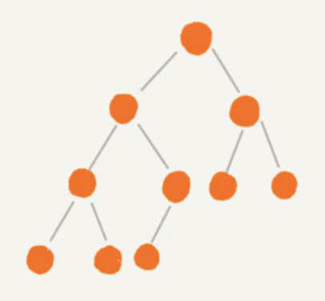
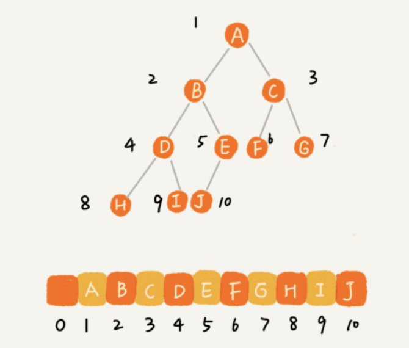
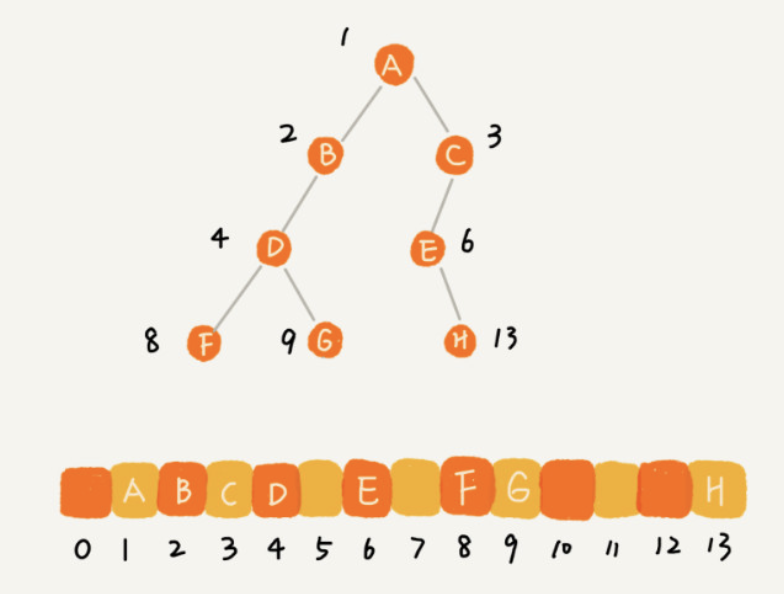

- ### 满二叉树和完全二叉树 #card
	- 满二叉树：
		- 1. 叶子节点全都在最底层
		  2. 除了叶子节点之外，每个节点都有左右两个子节点
		- {:height 148, :width 203}
	- 完全二叉树：
		- 1. 叶子节点都在最底下两层
		  2. 最后一层的叶子节点都靠左排列，并且除了最后一层，其他层的节点个数都要达到最大
		- {:height 171, :width 176}
		- 如果某棵二叉树是一棵完全二叉树，那用数组存储无疑是最节省内存的一种方式
		- {:height 229, :width 260}
		- {:height 217, :width 276}
	-
- ### 树的节点高度、深度、层数 #card
	- _1668479350453_0.jpeg)
	- _1668479375831_0.jpeg)
- ### 二叉树的前序、中序、后序、按层遍历 #card
	- 1. 前序遍历是指，对于树中的任意节点来说，先打印这个节点，然后再打印它的左子树，最后打印它的右子树。
	- 2. 中序遍历是指，对于树中的任意节点来说，先打印它的左子树，然后再打印它本身，最后打印它的右子树。
	- 3. 后序遍历是指，对于树中的任意节点来说，先打印它的左子树，然后再打印它的右子树，最后打印这个节点本身。
	- 每个节点最多被访问两次，时间复杂度 O(n)
	- _1668480320775_0.jpeg)
	- ```
	  前序遍历的递推公式：
	  preOrder(r) = print r->preOrder(r->left)->preOrder(r->right)
	   
	  中序遍历的递推公式：
	  inOrder(r) = inOrder(r->left)->print r->inOrder(r->right)
	   
	  后序遍历的递推公式：
	  postOrder(r) = postOrder(r->left)->postOrder(r->right)->print r
	  ```
-
- ## 常见算法
- ### 二叉树根节点到指定节点的路径
- ```TypeScript
  // 根节点 root，目标节点 target
  
  const path: TreeNode[] = []
  function dfs(root: TreeNode, path: TreeNode[], target: TreeNode) {
    if (!root) return false
    path.push(root)
    if (root === target) return true
    if (dfs(root.left, path, target)) return true
    if (dfs(root.right, path, target)) return true
    path.pop()
    return false
  }
  dfs(root, path, target)
  ```