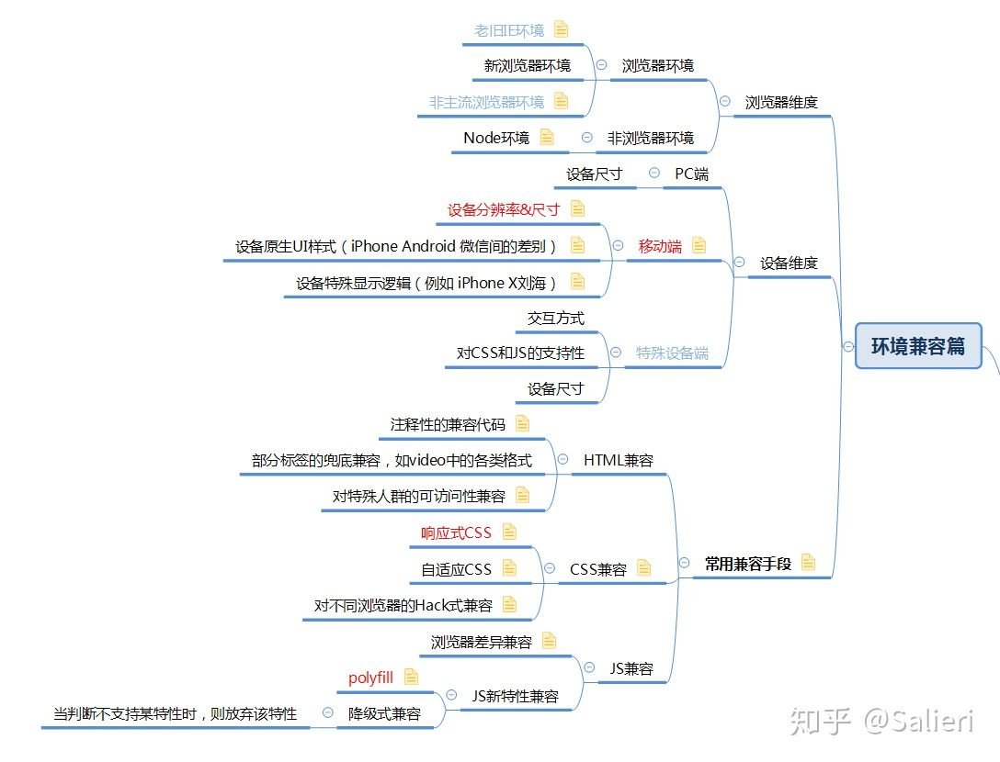

- 
- html5shiv
	- https://github.com/aFarkas/html5shiv
	- > The HTML5 Shiv enables use of HTML5 sectioning elements in legacy Internet Explorer and provides basic HTML5 styling for Internet Explorer 6-9, Safari 4.x (and iPhone 3.x), and Firefox 3.x.
	- ``` HTML
	  <!--[if lt IE 9]>
	    <script src="http://cdn.static.runoob.com/libs/html5shiv/3.7/html5shiv.min.js"></script>
	  <![endif]-->
	  ```
- Respond.js
	- https://github.com/scottjehl/Respond
	- > A fast & lightweight polyfill for min/max-width CSS3 Media Queries (for IE 6-8, and more)
- Reset CSS & normalize.css
	- https://meyerweb.com/eric/tools/css/reset/
	- > The goal of a reset stylesheet is to reduce browser inconsistencies in things like default line heights, margins and font sizes of headings, and so on.
	- https://github.com/necolas/normalize.css
	- > A modern alternative to CSS resets
	- Browser support: Chrome、Edge、Firefox ESR+、Internet Explorer 10+、Safari 8+、Opera
	- 参考：
	- https://jerryzou.com/posts/aboutNormalizeCss/
- Modernizr.js & CSS @supports
	- https://github.com/Modernizr/Modernizr
	- > Modernizr is a JavaScript library that detects HTML5 and CSS3 features in the user’s browser.
	- 参考：
	- [深入探讨 CSS 特性检测 @supports 与 Modernizr](https://juejin.cn/post/6844903465567649800)
- PostCSS
	- > PostCSS is a tool for transforming styles with JS [plugins](https://www.zhihu.com/search?q=plugins&search_source=Entity&hybrid_search_source=Entity&hybrid_search_extra=%7B%22sourceType%22%3A%22article%22%2C%22sourceId%22%3A%2238715068%22%7D). These plugins can lint your CSS, support variables and mixins, transpile future CSS syntax, inline images, and more.
	- 参考：
	- [各位前端大神能不能通俗的说一下PostCSS到底能做什么？对于手写css的优势在哪？ - 大漠的回答 - 知乎](https://www.zhihu.com/question/46312839/answer/190501092)
- CSS Hack
	- > In modern [computing](https://link.zhihu.com/?target=http%3A//en.wikipedia.org/wiki/Computer_science) terminology, a kludge (or often a "**hack**") is a solution to a problem, doing a task, or fixing a system that is inefficient, inelegant, or even unfathomable, but which nevertheless (more or less) works.
	- hack 是不优雅的、不是最有效的，甚至是不能理解的，但是能搞定问题的解决办法。
	- 那么 CSS hack 呢？CSS hack 就是利用浏览器一些不标准的，或者可以称之为 bug 的特性，达到特定的目的。最常见的各种 hack 是关于 ie 的，尤其是旧版本 ie。这种 hack 比较无奈，但是相对安全，因为旧版本 ie 不再更新了，不会发生变化了。
	- 但是，如果用一些当前浏览器的 bug 来 hack，就是有危险的了。这种 hack 建立在不稳定的浏览器特性上，没有标准可依。当浏览器厂商修复/标准化了这个特性的时候，hack 就可能失效。这样就解释了问题的这句话。
- html5shiv 低版本浏览器实现部分html5特性
- Respond.js 实现