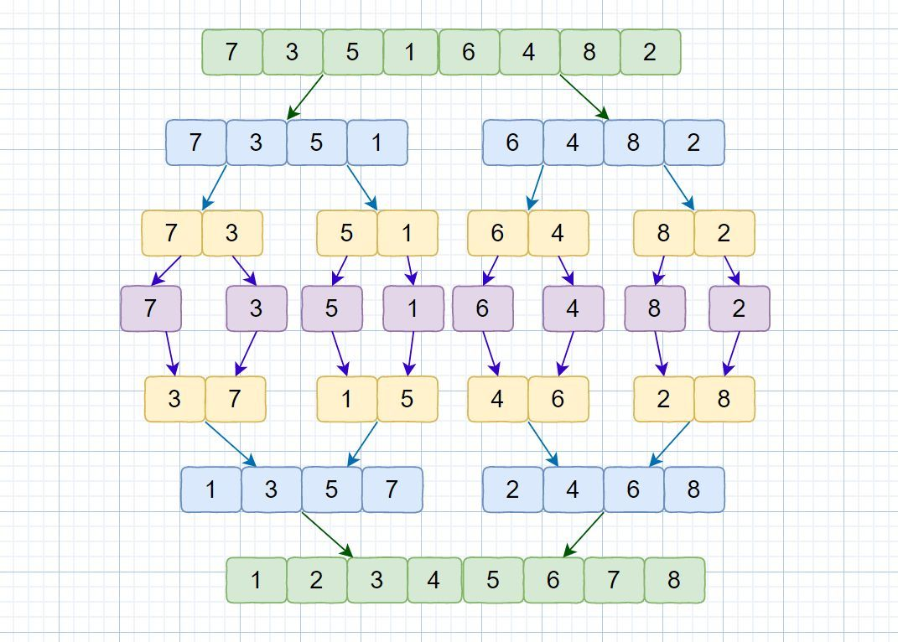

- [一张图搞懂归并排序](https://zhuanlan.zhihu.com/p/113133480)
- 
-
- 
-
-
- 递归实现 & 循环实现
-
- ```JavaScript
  function mergeSort(arr) {
    if (arr.length === 1) return arr
  
    const middle = arr.length >> 1
    const left = arr.slice(0, middle)
    const right = arr.slice(middle)
  
    return merge(mergeSort(left), mergeSort(right))
  }
  
  function merge(left, right) {
    let result = []
    let indexLeft = 0
    let indexRight = 0
  
    while (indexLeft < left.length && indexRight < right.length) {
      if (left[indexLeft] < right[indexRight]) {
        result.push(left[indexLeft])
        indexLeft++
      } else {
        result.push(right[indexRight])
        indexRight++
      }
    }
  
    return result.concat(left.slice(indexLeft)).concat(right.slice(indexRight))
  }
  ```
-
-
-
-
-
-
-
-
-
-
-
-
-
-
-
-
-
-
-
-
-
-
-
-
-
-