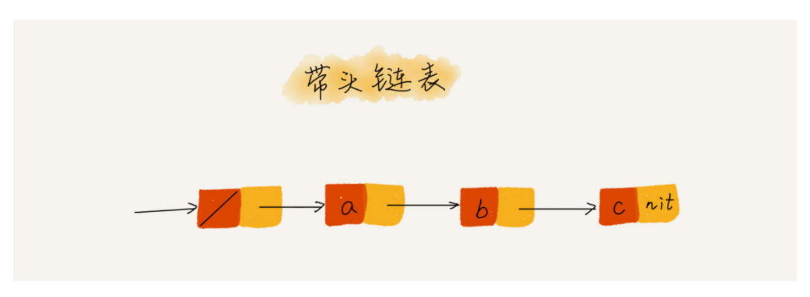
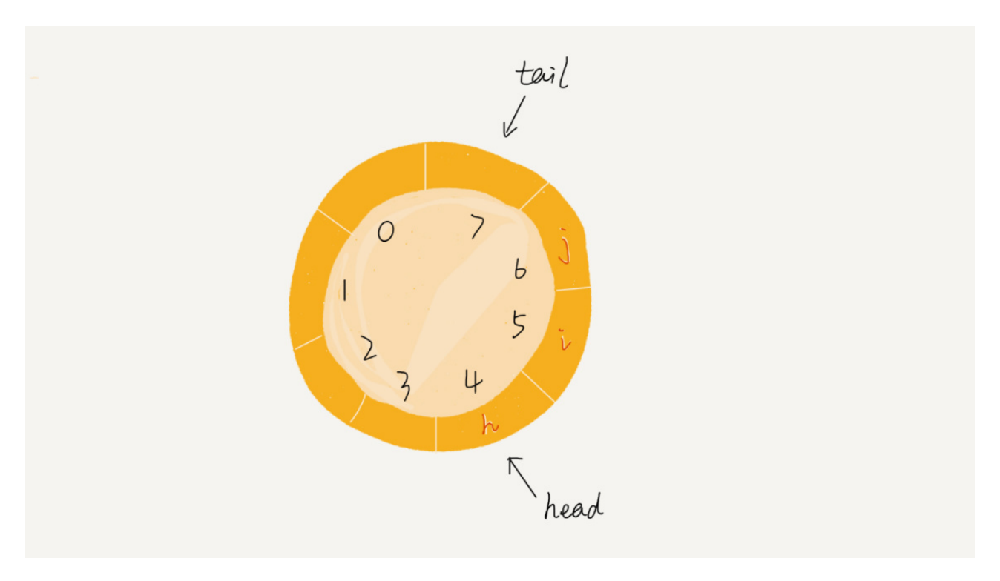
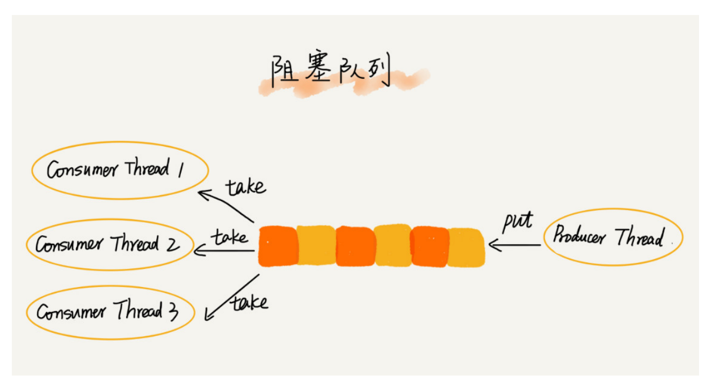

- # 数组
- 数组 Array #card
	- 1. 线性表数据结构
	  2. 用一组连续的内存空间，来存储一组具有相同类型的数据
- 线性表 Linear List #card
- 随机访问 #card
- 容器类型能否代替数组 #card
	- Java ArrayList
	- 优点：封装数组方法、支持动态扩容
	- 缺点：无法存储基本类型性能场景有损耗，性能场景大多数封装方法应该尽量避免使用
	- JavaScript Array 底层实现不是数组，而是哈希表
- 为什么大多数编程语言中，数组要从 0 开始编号 #card
	- 1. 下标代表偏移量，从0开始符合逻辑
	- 2. C 语言的选择，后续语言为了减少学习成本，延续了这个习惯。
	- Matlab 数组索引从1开始
-
- # 链表
- 数组简单易用，在实现上使用的是连续的内存空间，可以借助 CPU 的缓存机制，预读数组中的数据，所以访问效率更高。而链表在内存中并不是连续存储，所以对 CPU 缓存不友好，没办法有效预读。
- 除此之外，如果你的代码对内存的使用非常苛刻，那数组就更适合你。因为链表中的每个结点都需要消耗额外的存储空间去存储一份指向下一个结点的指针，所以内存消耗会翻倍。而且，对链表进行频繁的插入、删除操作，还会导致频繁的内存申请和释放，容易造成内存碎片，如果是 Java 语言，就有可能会导致频繁的 GC（Garbage Collection，垃圾回收）。
- ### 哨兵
- 如果我们引入哨兵结点，在任何时候，不管链表是不是空，head 指针都会一直指向这个哨兵结点。我们也把这种有哨兵结点的链表叫**带头链表**。相反，没有哨兵结点的链表就叫作**不带头链表**。
- 
- ### 注意边界条件的处理
	- 如果链表为空时，代码是否能正常工作？
	- 如果链表只包含一个结点时，代码是否能正常工作？
	- 如果链表只包含两个结点时，代码是否能正常工作？
	- 代码逻辑在处理头结点和尾结点的时候，是否能正常工作？
- ### 熟能生巧 #card
	- 单链表反转
	- 链表中环的检测
	- 两个有序的链表合并
	- 删除链表倒数第 n 个结点
	- 求链表的中间结点
- # 栈
- **栈是一种“操作受限”的线性表**，只允许在一端插入和删除数据。
- 为什么不用数组或链表替代栈？#card
	- 事实上，从功能上来说，数组或链表确实可以替代栈，但你要知道，**特定的数据结构是对特定场景的抽象**，而且，数组或链表暴露了太多的操作接口，操作上的确灵活自由，但使用时就比较不可控，自然也就更容易出错。
	- **当某个数据集合只涉及在一端插入和删除数据，并且满足后进先出、先进后出的特性，我们就应该首选“栈”这种数据结构**。
	- 实际上，栈既可以用数组来实现，也可以用链表来实现。用数组实现的栈，我们叫作**顺序栈**，用链表实现的栈，我们叫作**链式栈**。
- # 队列
- 跟栈一样，队列可以用数组来实现，也可以用链表来实现。用数组实现的栈叫作顺序栈，用链表实现的栈叫作链式栈。同样，用数组实现的队列叫作**顺序队列**，用链表实现的队列叫作**链式队列**。
- 循环队列
- {:height 308, :width 518}
- 阻塞队列
- 可以使用阻塞队列，轻松实现一个“生产者 - 消费者模型”。
- 配平效率
- 
- 并发队列
- 基于链表的实现方式，可以实现一个支持无限排队的无界队列（unbounded queue）
- 基于数组实现的有界队列（bounded queue）
-
- **实际上，对于大部分资源有限的场景，当没有空闲资源时，基本上都可以通过“队列”这种数据结构来实现请求排队。**
-
-
-
-
-
-
-
-
-
-
-
-
-
-
-
-
-