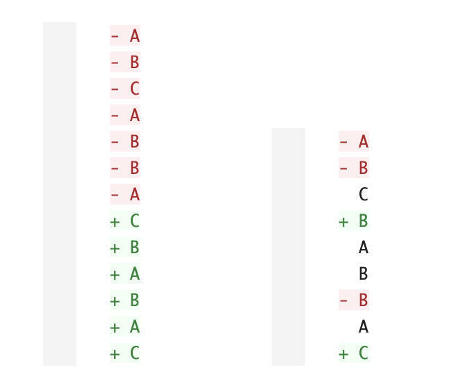

- 文本差分算法其实是一个历史悠久的经典算法问题，许多学者都有相关的研究，解决这个问题的思路也是百家争鸣，复杂度相差甚远。
- 而在git diff的实现里，其实就内置有多个不同的[diff算法](https://www.zhihu.com/search?q=diff%E7%AE%97%E6%B3%95&search_source=Entity&hybrid_search_source=Entity&hybrid_search_extra=%7B%22sourceType%22%3A%22article%22%2C%22sourceId%22%3A%22442986498%22%7D)，我们今天主要介绍的是git diff的默认算法：Myers 差分算法，这是一个相对简单、效率高且直观的文本差分算法（原论文）。
- 在学习这个算法之前，我们得首先来定义一下什么是文本差分(difference)，毕竟这个词本身就不是那么直观。
- 我们找原始出处，Myers在论文中，提到了这样一句话：
- > An edit script for A and B is a set of insertion and deletion commands that transform A into B.
- 其中有一个概念叫作 edit script，也就是[编辑脚本](https://www.zhihu.com/search?q=%E7%BC%96%E8%BE%91%E8%84%9A%E6%9C%AC&search_source=Entity&hybrid_search_source=Entity&hybrid_search_extra=%7B%22sourceType%22%3A%22article%22%2C%22sourceId%22%3A%22442986498%22%7D)。比如，对于源文本A和目标文本B，我们一定可以通过不断执行[删除行](https://www.zhihu.com/search?q=%E5%88%A0%E9%99%A4%E8%A1%8C&search_source=Entity&hybrid_search_source=Entity&hybrid_search_extra=%7B%22sourceType%22%3A%22article%22%2C%22sourceId%22%3A%22442986498%22%7D)和插入行两种操作，使得A转化成B，这样的一系列插入和删除操作的序列就被称作编辑脚本。**所以，文本差分算法，可以定义为用于求出输入源文本和目标文本之间的编辑脚本的算法，**广泛运用于各种需要进行文本对比的地方。
- 但是，两个文本之间的差分方式可能远远不止一种。
  
  比如说，对于任意两个文本A和B，我们总是可以通过将源文本逐行全部删去，再逐行添加目标文本的方式来做变换，也可以通过只修改差异部分的方式，做从A到B的变换，比如上面的例子中所展示的这样。
  
  那我们如何评价不同编辑脚本之间的优劣呢？
- ## 评价指标1
  
  第一个评价指标，其实也不难想到就是：**编辑脚本的长度**。
- 我们举一个论文中的例子来讨论，后面大部分讨论也都会基于这个例子展开：
- ```
  源序列 S = ABCABBA   目标序列 T = CBABAC
  ```
- 想要完成从S到T的变换，图中左边的编辑脚本就是前面所说的先删后添的方式，并没有体现出两个文档之间的修改点，显然不是一个很直观的变换表示；而右边的编辑脚本就明显好得多。
- {:height 369, :width 430}
- 直观地来说，右边的编辑脚本要比左边短的多，因为它尽可能保留了更多的原序列中的元素。
- 所以，一种符合直觉的文本差分算法的衡量指标，就是其**编辑脚本的长度，长度越短越好**。我们一会要介绍的Myers算法，也是在求一种最短的编辑脚本也就是SES（Shortest Edit Script）的算法。
- 但是SES要怎么求呢？原论文中也提到，最短编辑距离问题也就是SES，和最长公共子序列问题也就是LCS其实是一对对偶问题，如果求得其中一个问题的解等同于找到了另一个问题的解。
- 而最长公共子序列问题，相信许多准备过面试的同学都有所了解吧。大部分算法面试题中要求的解法复杂度是O(N*LogN)，采用[动态规划](https://www.zhihu.com/search?q=%E5%8A%A8%E6%80%81%E8%A7%84%E5%88%92&search_source=Entity&hybrid_search_source=Entity&hybrid_search_extra=%7B%22sourceType%22%3A%22article%22%2C%22sourceId%22%3A%22442986498%22%7D)就可以解决。不过呢，这并不是今天的重点，先不展开具体算法了。
- 这里我们简短地说明一下两个问题的关联性，还是用刚才的例子：
- ```
  源序列 
  S = ABCABBA length m = 7
  目标序列
  T = CBABAC  length n = 6
  - 最长公共子序列(不唯一)
  C = CBBA    length LC = 4
  ```
  我们很容易发现最短的编辑脚本的长度就等于 *m + n - 2 * LC* 。其中，M和N为原序列S和目标序列T的长度，LC为最长公共子序列的长度。这是因为在从原序列到目标序列的变化过程中，**两者的最长公共子序列中的元素我们都是可以保留的**，只需要在编辑脚本里，按顺序分别删除原序列和插入目标序列里不在公共序列中的元素即可。
- 当然，两个序列的最长公共子序列往往也不唯一，不同的最长公共子序列都对应着不同的编辑脚本产生，但这些编辑脚本一定都是最短的。
-
- 参考：
- [先导篇｜诶，这个 git diff 好像不是很直观？](https://zhuanlan.zhihu.com/p/442986498)
-