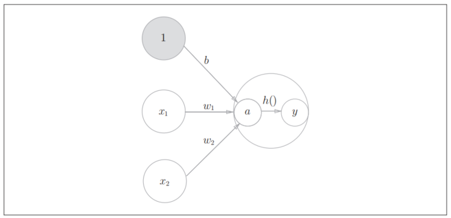
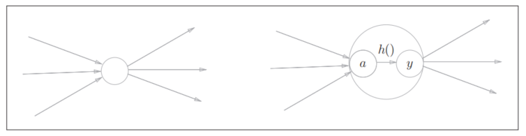

-
- {:height 370, :width 747}
- **激活函数**的作用在于决定如何来激活输入信号的总和。
- 上图中h()即为激活函数。
-
- 
- 通常a和y一起被称为**神经元**或**节点**。
-
- 神经网络的激活函数必须使用非线性函数。因为使用线性函数的话，加深神经网络的层数就没有意义了。线性函数的问题在于，不管如何加深层数，总是存在与之等效的“无隐藏层的神经网络”。
-
- 中间层激活函数：
- [[Sigmoid Function]]
  logseq.order-list-type:: number
- [[ReLU Function]]
  logseq.order-list-type:: number
-
- 输出层激活函数：
- 恒等函数，一般用在回归问题上
- [[Softmax Function]]，一般用在分类问题上
-