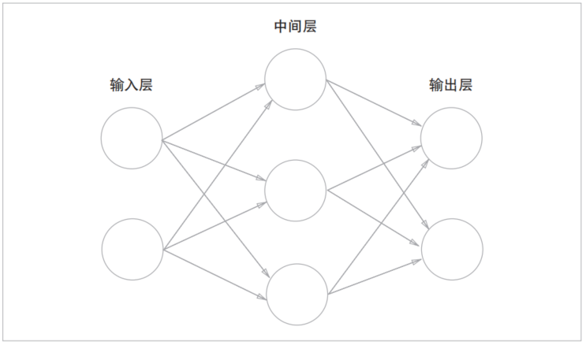

- 神经网络的结构
- {:height 320, :width 531}
- 我们把最左边的一列称为**输入层**，最右边的一列称为**输出层**，中间的一列称为**中间层**。中间层有时也称为**隐藏层**。“隐藏”一词的意思是，隐藏层的神经元（和输入层、输出层不同）肉眼看不见。
-
- 神经网络可以用在分类问题和回归问题上。
-
- [[激活函数 Activation Function]]
-
- 输出层的神经元数量需要根据待解决的问题来决定。对于分类问题，输出层的神经元数量一般设定为类别的数量。比如，对于某个输入图像，预测是图中的数字0到9中的哪一个的问题（10类别分类问题），可以像图3-23这样，将输出层的神经元设定为10个。
-
- 神经网络直接学习图像本身。在第2个方法，即利用特征量和机器学习的方法中，特征量仍是由人工设计的，而在神经网络中，连图像中包含的重要特征量也都是由机器来学习的。
-
- 神经网络的优点是对所有的问题都可以用同样的流程来解决。比如，不管要求解的问题是识别5，还是识别狗，抑或是识别人脸，神经网络都是通过不断地学习所提供的数据，尝试发现待求解的问题的模式。也就是说，与待处理的问题无关，神经网络可以将数据直接作为原始数据，进行“端对端”的学习。
-
- 机器学习中，一般将数据分为**训练数据**和**测试数据**两部分来进行学习和实验等。
- 为了正确评价模型的**泛化能力**，就必须划分训练数据和测试数据。另外，训练数据也可以称为**监督数据**。
-
- 因此，仅仅用一个数据集去学习和评价参数，是无法进行正确评价的。这样会导致可以顺利地处理某个数据集，但无法处理其他数据集的情况。顺便说一下，只对某个数据集过度拟合的状态称为**过拟合 Over Fitting**。避免过拟合也是机器学习的一个重要课题。
-
- [[损失函数 Loss Function]]
-
-