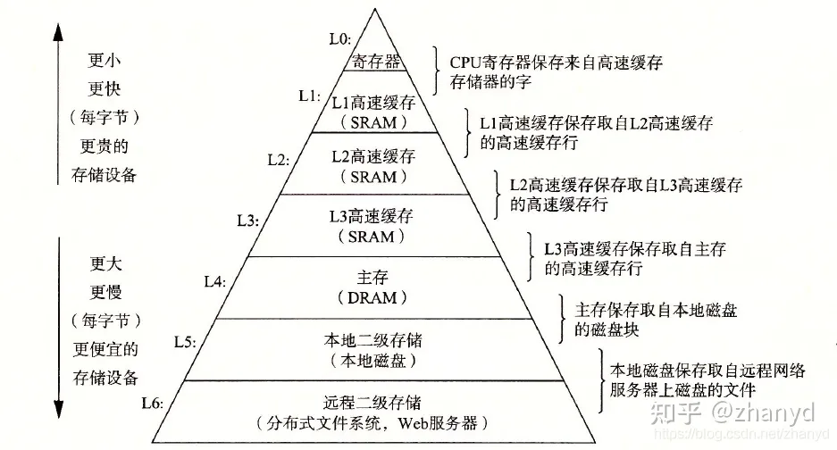
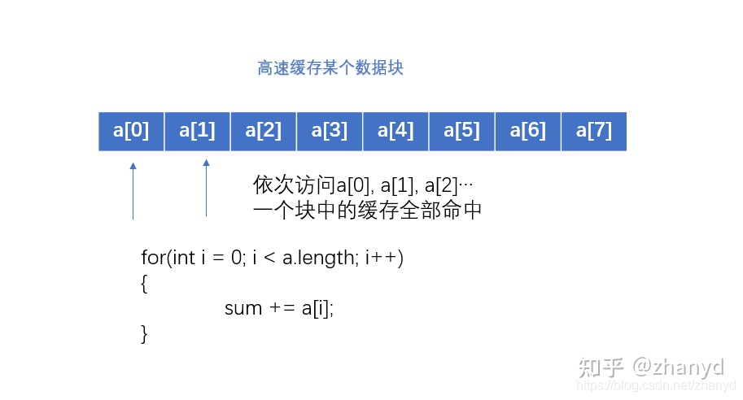

- 
-
- ## 局部性原理
- 在CPU访问寄存器时，无论是存取数据抑或存取指令，都趋于聚集在一片连续的区域中，这就被称为局部性原理。 
  时间局部性（temporal locality） ：被引用过一次的存储器位置在未来会被多次引用（通常在循环中）。 
  空间局部性（spatial locality）：如果一个存储器的位置被引用，那么将来他附近的位置也会被引用。
-
- 一个优秀的程序通常具有良好的局部性，它们通常会重复使用已用过的数据，或者使用已用过数据的邻近数据，也就是说，程序常常会使用集中在一起的局部数据。
- 局部性分为：时间局部性和空间局部性。如果一个内存位置被重复的引用，那就是有了时间局部性，如果一个内存位置被引用了，很快这个位置的附近位置也被引用了，这就有了空间局部性。
- 由于缓存中的数据是一个个数据块，每个数据块包含几十到几千字节不等，如果某个程序要访问数组a，第一次缓存没命中，cpu会从主存中取出包含数组a的一个数据块，复制到缓存中来，下次访问a[1],a[2],a[3]的数据时每次都缓存命中，极大的提高了效率，实现了空间的局部性。
- 
- ```JavaScript
  // 制造 10000*10000 的测试用二维数组
  const arr = []
  for(let i = 0; i < 10000; i++) {
      for (let j = 0; j < 10000; j++) {
          arr[i] ? arr[i].push(j) : arr[i] = [j]
      }
  }
  
  // 以行顺序和列顺序的方式遍历数组求 sum
  // 由于数组遍历的空间局部性，行顺序命中更高速缓存的概率远高于列顺序遍历的数组
  // sum1: 160.988ms
  // sum2: 1.973s
  console.time("sum1")
  let sum1 = 0
  for(let i = 0; i < 10000; i++) {
      for (let j = 0; j < 10000; j++) { sum1 += arr[i][j] }
  }
  console.timeEnd("sum1")
  
  console.time("sum2")
  let sum2 = 0
  for(let i = 0; i < 10000; i++) {
      for (let j = 0; j < 10000; j++) { sum2 += arr[j][i] }
  }
  console.timeEnd("sum2")
  ```
-
-
- **空间和时间局部性描述了程序如何访问数据（或指令）的两个不同特征。**
- 如果在时间上被引用的事物在空间上也接近（相邻的存储器地址，磁盘上的邻近扇区等），则引用序列被认为具有**空间局部性(Spatial Locality)**。
- 如果对同一事物的访问在时间上聚集在一起，则该序列被称为具有**时间局部性(Temporal Locality)。**
- ```JavaScript
  const arr = [1, 2, 3, 4, 5]
  let sum = 0
  for (let i = 0; i < arr.length; i++) {
    sum += arr[i]
  }
  ```
- 在上述代码中，sum为时间局限性Temporal Locality，因为sum被引用了多次。
- 数组 arr 为空间局限性spatial Locality，因为如果a[i]被使用，则a[i+1],a[i-1]…很可能被引用。