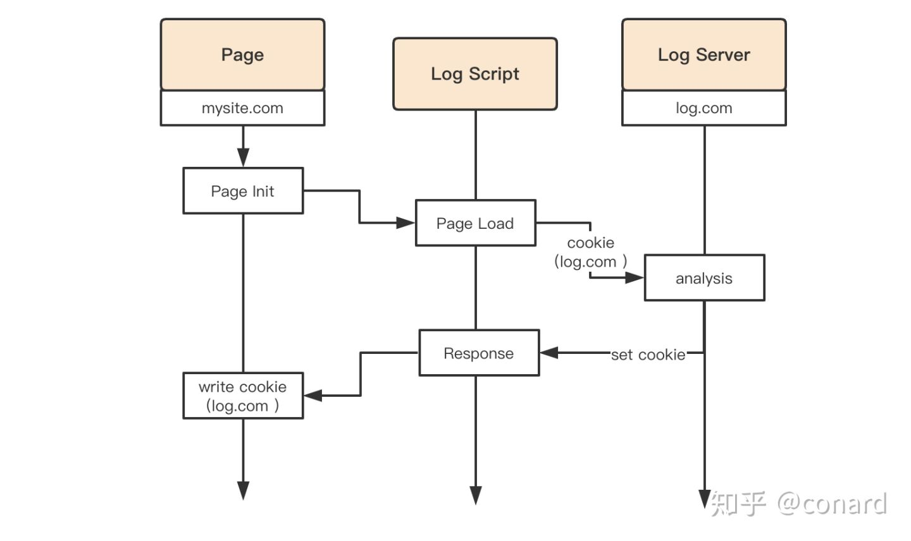

- ## 概念
- Domain 属性为当前页面域的 [eTLD]([[有效顶级域名 effective Top-Level-Domain]])+1 或其任何子域的 Cookie 称为 First-Party Cookie。
- 其余 Domain 的 Cookie 均为 Third-Party Cookie，第三方 Cookie 由当前页面中的跨源请求设置。
- 第一方、第三方是一个相对概念，Cookie 的读写权限和作用域并没有被改变。
- ## 第三方 Cookie 的使用场景
- 1. 广告运营商通过第三方 Cookie 实现用户跟踪
  2. 多门户公司可能会用第三方 Cookie 实现多门户串联的登录验证，例如淘宝与天猫
  3. 第三方的前端日志埋点监控服务
  {:height 371, :width 624}
- ## 关于第三方 Cookie 的末路
- 在  Safari 13.1、Firefox 79 版本中，第三方 Cookie 已经被默认禁用，禁用第三方 Cookie 意味着跨域请求既不能设置 Cookie，在 request header 中也不会携带 Cookie。
- 截止 2022.9.6 Chrome 仍未禁止第三方 Cookie。
- ## 禁用第三方 Cookie 导致的一些问题
- 天猫和飞猪的页面靠请求淘宝域名下的接口获取登录信息，由于 Cookie 丢失，用户无法登录，页面还会误判断成是由于用户开启了浏览器的“禁止第三方 Cookie”功能导致而给与错误的提示
- 淘宝部分页面内嵌支付宝确认付款和确认收货页面、天猫内嵌淘宝的登录页面等，由于 Cookie 失效，付款、登录等操作都会失败
- 阿里妈妈在各大网站比如今日头条，网易，微博等投放的广告，也是用 iframe 嵌入的，没有了 Cookie，就不能准确的进行推荐
- 一些埋点系统会把用户 id 信息埋到 Cookie 中，用于日志上报，这种系统一般走的都是单独的域名，与业务域名分开，所以也会受到影响。
- 一些用于防止恶意请求的系统，对判断为恶意请求的访问会弹出[验证码](https://www.zhihu.com/search?q=%E9%AA%8C%E8%AF%81%E7%A0%81&search_source=Entity&hybrid_search_source=Entity&hybrid_search_extra=%7B%22sourceType%22%3A%22article%22%2C%22sourceId%22%3A%22114093227%22%7D)让用户进行安全验证，通过安全验证后会在请求所在域种一个Cookie，请求中带上这个Cookie之后，短时间内不再弹安全验证码。在Chrome80以上如果因为Samesite的原因请求没办法带上这个Cookie，则会出现一直弹出验证码进行安全验证。
- 天猫商家后台请求了跨域的接口，因为没有 Cookie，接口不会返回数据